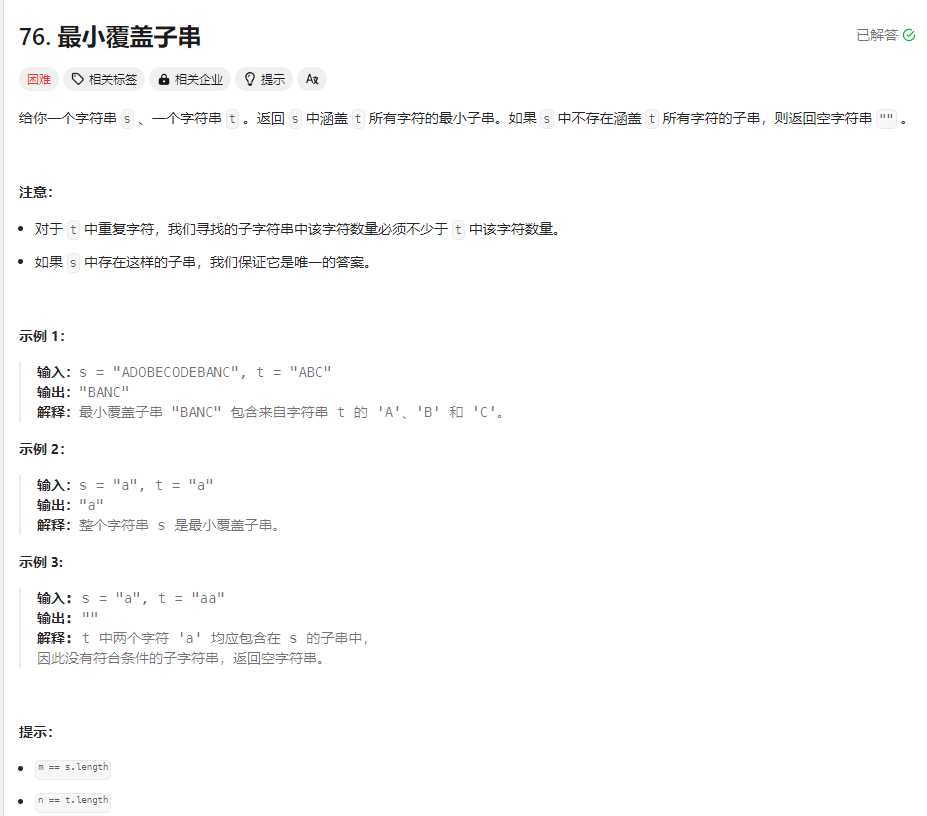
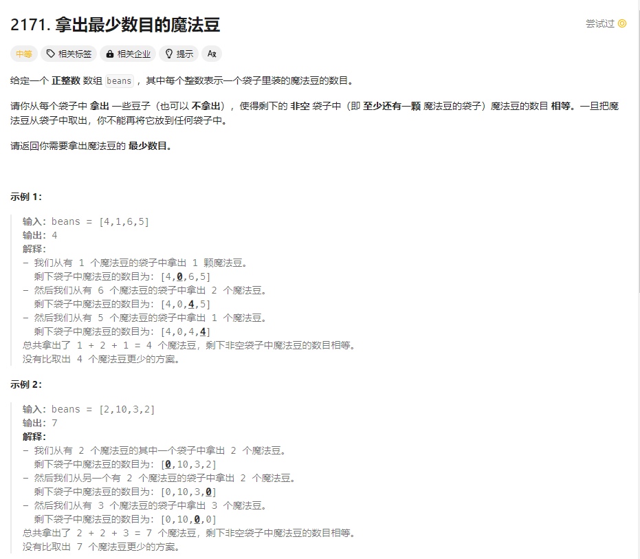
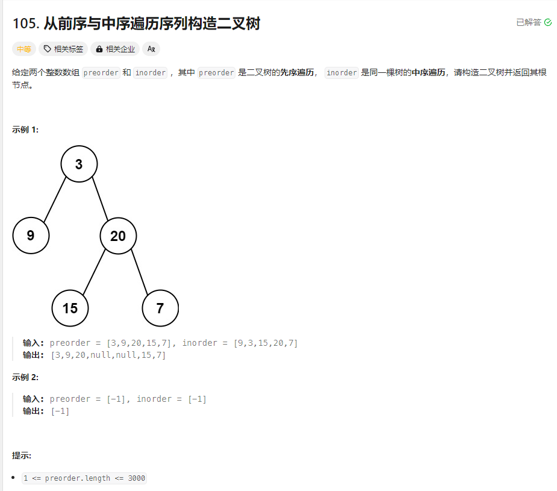
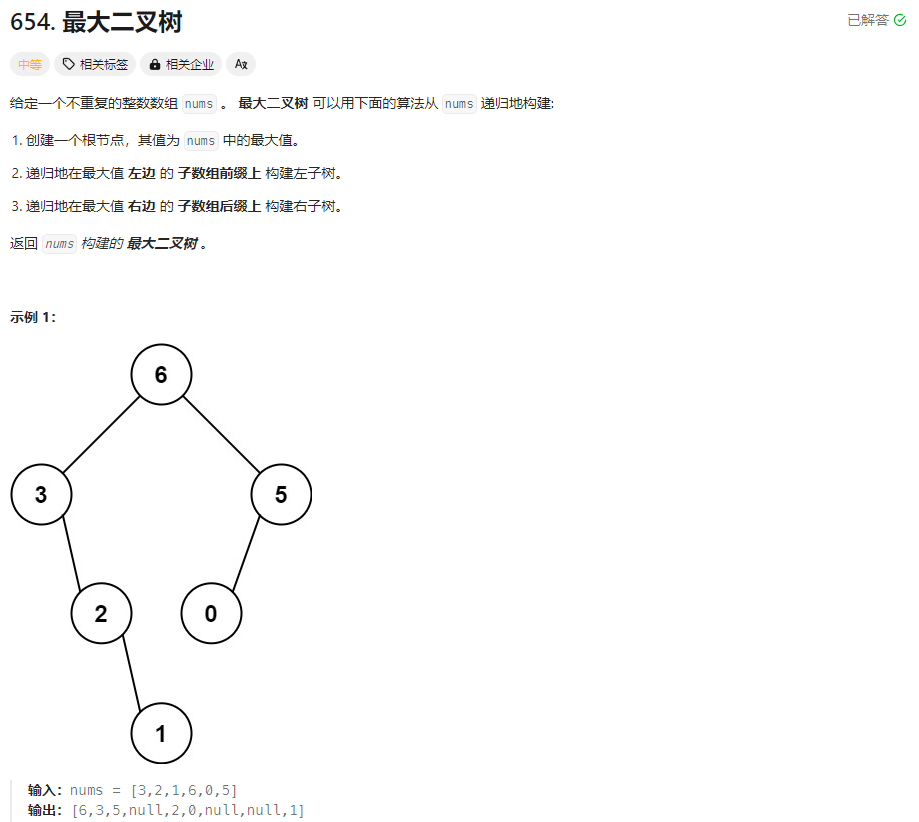
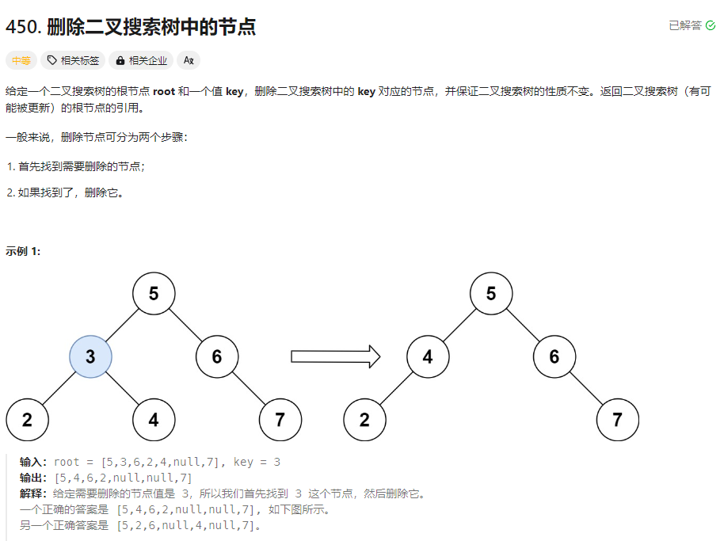
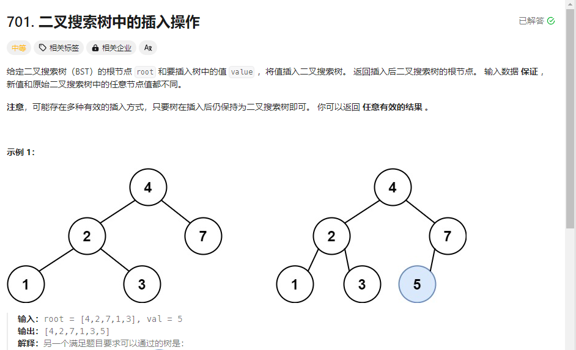
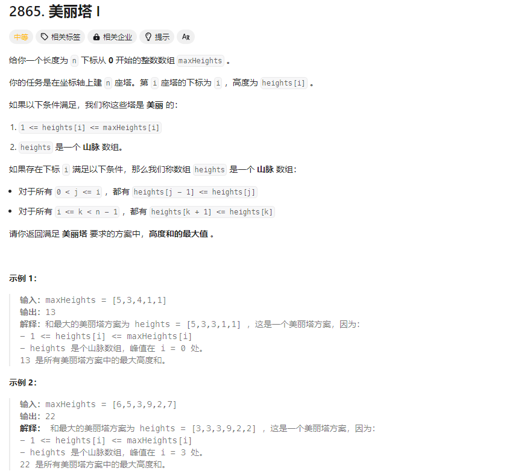

# 滑动窗口
## 思路
采用左闭右开的方式，即[l,r),开始时r先不断移动，知道找到第一个满足题意的解，之后再慢慢移动l，缩小窗口，直到不满足题意为止，此时继续移动r。重复上述过程，直到r遍历完整个字符串。

```
例1.
class Solution {
    public String minWindow(String s, String t) {
        HashMap<Character,Integer> need = new HashMap<>();//记录目标字符t的情况
        HashMap<Character,Integer> window = new HashMap<>();//记录窗口内的情况
        int stringlen = s.length();
        for(int i = 0;i < t.length();i++){
            need.put(t.charAt(i),need.getOrDefault(t.charAt(i),0)+1);
        }//将目标字符串t的相关信息更新到哈希表中
        int l = 0, r = 0;//窗口的左指针和右指针
        int start = 0, len = Integer.MAX_VALUE;//记录子字符串的起始位置和长度，便于返回结果
        int valid = 0;//窗口中符合子字符串t要求的字符数目
        while(r < stringlen){
            char c = s.charAt(r);
            r++;
            window.put(c,window.getOrDefault(c,0)+1);
            if(need.containsKey(c)){
                if(window.get(c).equals(need.get(c))){
                    valid++;
            }
            }//一直移动r，直到找到第一个可行解
            while(valid == need.size()){
                if(r - l < len){
                    start = l;
                    len = r - l;
                }//更新结果
                char ch = s.charAt(l);
                l++;
                if(need.containsKey(ch)){
                    if(window.get(ch).equals(need.get(ch))){
                        valid--;
                    }
                    window.put(ch,window.get(ch)-1);
                }
            }//不断缩小窗口，直到窗口内的字符不符合要求为止
        }//不断重复上述过程
        return len == Integer.MAX_VALUE?"":s.substring(start,start+len);
    }
}
```
# 前缀和
例1

```
class Solution {
    public long minimumRemoval(int[] beans) {
        int n = beans.length;
        long[] perfix = new long[n];
        perfix[0] = beans[0];
        for(int i = 1;i < n;i++){
            perfix[i] = perfix[i-1] + beans[i];
        }
        Arrays.sort(beans);
        long min = perfix[n-1];
        for(int i = 0;i < n;i++){
            long least = (perfix[i] - (long)beans[i]) + ((perfix[n-1] - perfix[i]) - (n-1-i) * (long)beans[i]);
            min = least < min ?least:min;
        }
        return min;
    }
}
```
# 二叉树
## 使用分解法的思路
在写递归函数时不需要对递归到底干了什么很明确，只需要注意边界值，以及利用递归的返回值干什么就可以了，也就是说可以把下一层（子树）的递归语句当成普通的变量语句使用。可以顺序性分为以下三个部分：1.边界条件设立 2.计算下一层递归所需的相应变量 3.进行下一层递归，并获取下一层递归的返回值 4.使用下一次递归的返回值做本层的事情
例1.给定前序序列和中序序列，构造对应的二叉树

```
class Solution {
    public TreeNode buildTree(int[] preorder, int[] inorder) {
        return build(preorder,inorder,0,preorder.length - 1,0,inorder.length - 1);
    }

    public TreeNode build(int[] preorder, int[] inorder, int pl, int pr, int il, int ir){
        if(pl > pr || il > ir){
            return null;
        } //设立边界条件
        int index = -1;
        int value = preorder[pl];
        for(int i = il;i <= ir;i++){
            if(inorder[i] == preorder[pl]){
                index = i;
                break;
            }
        }
        int left_pl = pl + 1; //左子树的前序左边界
        int left_pr = pl + (index - il);//左子树的前序右边界
        int left_il = il;//左子树的中序左边界
        int left_ir = index - 1;//左子树的中序右边界
        int right_pl = pl + (index - il + 1);//右子树的前序左边界
        int right_pr = pr;//右子树的前序右边界
        int right_il = index + 1;//右子树的中序左边界
        int right_ir = ir;//右子树的中序右边界 
        //更新下一次递归所需要的条件，这里因为是左右子树分别递归，所以需要分别计算左右子树对应的变量
        TreeNode left = build(preorder,inorder,left_pl,left_pr,left_il,left_ir);//不考虑那么多，简单把左子树的递归返回值当成left变量
        TreeNode right = build(preorder,inorder,right_pl,right_pr,right_il,right_ir);//不考虑那么多，简单把右子树的递归返回值当成right变量
        TreeNode root = new TreeNode(value);
        root.left = left;
        root.right = right;//使用下一层的返回值干本层的事情，该题表现为构造左右子树
        return root;
    }
}
```
例2.最大二叉树

```
class Solution {
    public TreeNode constructMaximumBinaryTree(int[] nums) {
        return bulid(nums,0,nums.length - 1);
    }
    public TreeNode bulid(int[] nums, int l, int r){
        if(l > r){
            return null;
        }//边界条件
        int maxValue = Integer.MIN_VALUE;
        int index = -1;
        for(int i = l;i <= r;i++){
            if(nums[i] > maxValue){
                maxValue = nums[i];
                index = i;
            }
        }//计算下一层递归需要的变量
        TreeNode left = bulid(nums,l,index-1);不考虑那么多，简单把左子树的递归返回值当成left变量，直接将这里返回的变量left当成已经符合题目要求的树
        TreeNode right = bulid(nums,index+1,r);不考虑那么多，简单把右子树的递归返回值当成right变量，直接将这里返回的变量right当成已经符合题目要求的树
        TreeNode root = new TreeNode(maxValue);
        root.left = left;
        root.right = right;
        return root;
    }
}
```

## 二叉搜索树



```
class Solution {
    public TreeNode deleteNode(TreeNode root, int key) {
        return delete(root,key);
    }

    public TreeNode delete(TreeNode root,int val){
        if(root == null){
            return null;
        }
        if(root.val == val && root.left == null){
            return root.right;
        }
        if(root.val == val && root.right == null){
            return root.left;
        }//上面两条if语句处理了欲删除节点对应左右子树为空，左子树为空，或者右子树为空的情况，这种情况下只需要返回另一个不为空的子树或者null就可以了
        if(root.val == val){
            TreeNode p = getRightestNode(root.left);得到左子树中最右边的节点，用来代替root
            root.left = delete(root.left,p.val);需要先删除该最右节点，不然如果它还有左子树的话不好处理，因为该最右节点的右子树是空，其实对应的是上述两条if语句的情况
            p.left = root.left;
            p.right = root.right;交换左右孩子，用左子树中最右边的节点代替root
            return p;返回的p会成为上一层的左孩子或者右孩子，这样root就被删除了
        }
        if(root.val > val){
            root.left = delete(root.left, val);
        }else{
            root.right = delete(root.right, val);
        }//去找符合条件的节点，使用二叉搜索树的搜索法
        return root;
    }

    public TreeNode getRightestNode(TreeNode root){
        while(root.right!=null){
            root = root.right;
        }
        return root;
    }
}
```


```
class Solution {
    public TreeNode insertIntoBST(TreeNode root, int val) {
        if(root == null){
            return new TreeNode(val);
        }
        if(root.val > val){
            BSTorder(root.left,root,val,0);
        }else{
            BSTorder(root.right,root,val,1);
        }
        return root;
    }

    public void BSTorder(TreeNode root, TreeNode pre, int val, int mark){
        if(root == null){
            if(mark == 0){
                pre.left = new TreeNode(val);
            }else{
                pre.right = new TreeNode(val);
            }
            return;
        }
        if(root.val > val){
            BSTorder(root.left,root,val,0);
        }else{
            BSTorder(root.right,root,val,1);
        }
    }
}
```
# 单调栈

# 回溯法
核心代码:
```
    List<List<Integer>> ans = new LinkedList<>();
    List<Integer> track = new LinkedList<>();

    public void backtrack(int n, int start){
        if(...){
            ans.add(new LinkedList<>(track));
            return;
        }
        for(int i = start;i <= n;i++){
            track.addLast(i);//添加
            backtrack(n, i+1);
            track.removeLast();//删除
        }
    }
```
## 1.元素不可重复且不可复选：
此时为最普通的回溯法，只需要在核心代码框架...处添加到底条件即可
例题：力扣46，77，78, 216
值得注意的是在78子集一题中，返回值数组的长度与参数数组长度不一致，也即是允许数组对应位置为空的，比如求1，2，3的子集，子集1，2就可以想象为是数组[1,2,null]，在这种情况下只存在参数数组对应位置的数字是否存在于结果数组中，其相对位置是不变的，因此隐藏的达成了“不可复选”这一条件；而对46题全排列，由于其元素的相对位置会发生改变，因此在不可复选的情况下需要使用visited数组来表示其是否有被访问过
## 2.元素可重复不可复选
此时需要对1.的情况进行剪枝，通常需要先对参数数组进行排序，然后跳过重复的元素使其不进行回溯
例题：力扣47，90
## 3.元素无重复可复选
把1.中的visited去掉即可，需要注意的是要保持元素的相对位置，也就是说要注意start的值，它应该是单增不减的，如果是从0开始，那么会出现重复的情况
例题：力扣19
