# 注解
## 内置注解：
Supresswarning，
deprecated，
override
## 元注解
元注解即为注解的注解
@Target：表示注解可以用在哪些地方(方法，类，变量.....)

@Retention:表示注解在什么阶段有效(source:源码阶段，class:编译阶段，runtime：运行阶段)，作用范围runtime > class > source

@Document：表示是否将注解生成在javadoc中

@Inherited：表示子类可以继承父类的注解
## 注解的参数
注解的参数：参数类型 + 参数名（），如
```
@interface MyAnnotation{
    String name(); //参数类型为String，参数名为name
    int age() default 0; //参数类型为int，参数名为age,默认值为0
    int id() default -1; //参数类型为int，参数名为id,默认值为-1,代表不存在
    String[] like(); //参数类型为String数组，参数名为like
}
```
# 反射
## 使用反射的一些例子

1.Spring/Springboot等框架大量使用动态代理，**动态代理依赖于反射机制**。

2.注解也使用了反射


## 获取Class类实例的几个方式：
1.若已知具体的类，则通过该类的class属性获取
```
Class cla = Person.class;
```
2.已经某个类的实例，通过该实例的getClass()方法获取
```
Class cla = person.getClass();
```
3.已经一个类的全类名以及它的包路径，通过Class类的静态方法forName(String className)获取
```
Class cla = Class.forName("com.company.Person");
```
4.通过类加载器获取
5.内置类型的包装类（Integer等）可以直接使用类名.Type

## 反射使用实践
1.创建需要反射的类
```java
package com.cytus.learnspb.exercises;

/*
* 反射需要使用的目标类
* */
public class TargetObject {
    private String value;
    public TargetObject()
    {
        value = "反射目标类";
    }
    public void publicMethod(String s)
    {
        System.out.println("one public method:"+s);
    }
    private void privateMethod(String s) {
        System.out.println("one private method:" + s);
    }
}

```
2.反射使用该类
```java
package com.cytus.learnspb.exercises;

import java.lang.reflect.Field;
import java.lang.reflect.InvocationTargetException;
import java.lang.reflect.Method;

/*
* 练习反射
* */
public class InvocationLearn {
    // 使用反射操作TargetObject的方法和参数

    public static void main(String[] args) throws ClassNotFoundException, NoSuchMethodException, InstantiationException, IllegalAccessException, InvocationTargetException, NoSuchFieldException {
        /*
        * 1.获取TargetObject类的class对象，再为对象创建TargetObject实例
        * 这里理解为:获取对象实际上获取的是TargetObject这个类的元信息对象(即Class的对象class)
        * 然后通过元对象(class)的newInstance()方法创建TargetObject的实例
        * */
        // 通过类名的全路径加载，四种获得class对象的方式？
        Class<?> targetClass = Class.forName("com.cytus.learnspb.exercises.TargetObject");
        TargetObject targetObject = (TargetObject) targetClass.newInstance();

        /*
        * 获取TargetObject中的所有方法
        * */
        Method[] methods = targetClass.getDeclaredMethods();
        // 打印所有方法名查看
        for(Method method:methods)
        {
            System.out.println(method.getName());
        }

        /*
        * 获取指定方法并调用
        * 寻找方法时当然需要方法名和参数类型
        * */
        Method publicMethod = targetClass.getDeclaredMethod("publicMethod", String.class);
        // invoke()调用方法，传入对象和方法的参数
        publicMethod.invoke(targetObject,"反射调用方法"); // 用invoke调用对象的方法(为什么不能直接调用呢？)

        /*
        * 获取类中的指定参数并进行修改, Declared开头会获取所有，否则就只有公共的
        * */
        Field field = targetClass.getDeclaredField("value");
        field.setAccessible(true); // 设置可访问权限
        field.set(targetObject, "JavaGuide"); // 传入对象和值作为参数

        /*
        * 获得private参数并调用，多了setAccessible而已
        * */
        Method privateMethod = targetClass.getDeclaredMethod("privateMethod", String.class);
        // invoke()调用方法，传入对象和方法的参数
        privateMethod.setAccessible(true);
        privateMethod.invoke(targetObject,"反射调用私有方法"); // 用invoke调用对象的方法(为什么不能直接调用呢？)
    }
}

```
## 类的加载与初始化
加载：将class文件字节码内容加载到内存中，并将这些静态数据转换成方法区的运行时数据结构，然后**生成一个代表这个类的java.lang.Class对象**

链接：
（1）.验证：确保加载的类信息符合JVM规范，没有安全方面问题
（2）.准备：为类的**静态变量**分配内存，并将其**初始化为默认值**
（3）.解析：将虚拟机常量池中的符号引用（常量名）转换为直接引用（地址）
初始化：
（1）.执行类构造器**clinit**()方法的过程，类构造器**clinit**()方法是由编译期自动收集类中所有类变量的赋值动作和静态代码块中的语句合并产生的。（类构造器是构造类信息的，不是构造该类对象的构造器）
（2）.当初始化一个类时，如果其父类还未初始化，那么会先触发父类的初始化
（3）.虚拟机保证了**cinit**方法能在多线程环境下被正确加锁和同步

### 反射动态创建对象
```
获得class对象：class对象
Class cla = Class.forName("com.company.Person");
//创建对象
Person person = (Person)cla.newInstance();
//传入参数获取对应构造器
Constructor con = cla.getDeclaredConstructor(String.class,int.class);
//通过构造器创建对象
Person person = (Person)con.newInstance()
```
### 反射调用方法
```
//通过反射调用普通方法
User user3 = (User)cla.newInstance();
//通过反射获取一个方法
Method setName = c1a.getDeclaredMethod("setName",String.class);
//通过反射调用方法
setName.invoke(user3,"张三");
```
### 反射操作属性
```
User user4 = (User)cla.newInstance();
//通过反射获取一个属性
Field name = cla.getDeclaredField("name");
//取消属性的访问检查(如果这个属性被设置为私有的)
name.setAccessible(true);
name.set(user4,"张三");
```

## 通过反射操作注解
先自定义一个注解
```
//表名的注解
@Target(ElementType.TYPE)
@Retention(RetentionPolicy.RUNTIME)
public @interface Table {
    String value();
}
```
```
//属性名的注解
@Target(ElementType.FIELD)
@Retention(RetentionPolicy.RUNTIME)
public @interface Field {
    String colunmName();
    String name();
    int length();
}
```
```
//定义一张表
@Tbale("tb_student")
public class Student{
    @Field(colunmName="id",length=10,type="int")
    private int id;
    @Field(colunmName="name",length=255,type="varchar")
    private String name;
    @Field(colunmName="age",length=10,type="int")
    private int age;
    .......
}
```
```
//通过反射获取注解
Class cla = Class.forName("com.company.Student");
Annotation[] annotations = cla.getAnnotations();
for (Annotation annotation : annotations) {
    System.out.println(annotation);
}
//获得注解对应value的值
Annotation annotation = cla.getAnnotation(Table.class);
Table table = (Table)annotation;
String value = table.value();
System.out.println(value);

//获得类指定的注解
Field field = cla.getDeclaredField("id");
Field annotation1 = field.getAnnotation(Field.class);
System.out.println(annotation1.colunmName());// 打印id
System.out.println(annotation1.length());// 打印10
System.out.println(annotation1.type()); // 打印 int
```

## 设计模式
### 代理模式
#### 静态代理
静态代理是通过在工具类中持有目标类实例，并通过工具类调用相关方法来实现在原有业务流程上添加方法
```
原有类
package com.lijie;

//接口类
public class UserDao{
	public void save() {
		System.out.println("保存数据方法");
	}
}
package com.lijie;

//运行测试类
public  class Test{
	public static void main(String[] args) {
		UserDao userDao = new UserDao();
		userDao.save();
	}
}
```
如果想要在save之前开启事务，在save之后关闭事务，在不影响原有业务流程的情况下，启用静态代理
```
package com.lijie;

//代理类
public class UserDaoProxy extends UserDao {
	private UserDao userDao;

	public UserDaoProxy(UserDao userDao) {
		this.userDao = userDao;
	}

	public void save() {
		System.out.println("开启事物...");
		userDao.save();
		System.out.println("关闭事物...");
	}

}

//添加完静态代理的测试类
public class Test{
	public static void main(String[] args) {
		UserDao userDao = new UserDao();
		UserDaoProxy userDaoProxy = new UserDaoProxy(userDao);
		userDaoProxy.save();
	}
}
```
#### 动态代理
静态代理的问题在于每个被代理类都需要编写自己的代理类，会显得代码冗余
因此采用动态代理的方式，使用反射创建代理对象和调用方法
```
package com.lijie;

//接口
public interface UserDao {
    void save();
}
```
```
package com.lijie;

//接口实现类
public class UserDaoImpl implements UserDao {
	public void save() {
		System.out.println("保存数据方法");
	}
}
```
代理接口：
```
package com.lijie;

import java.lang.reflect.InvocationHandler;
import java.lang.reflect.Method;

// 每次生成动态代理类对象时,实现了InvocationHandler接口的调用处理器对象
public class InvocationHandlerImpl implements InvocationHandler {

	// 这其实业务实现类对象，用来调用具体的业务方法
    private Object target;

    // 通过构造函数传入目标对象
    public InvocationHandlerImpl(Object target) {
        this.target = target;
    }

    //动态代理实际运行的代理方法
    public Object invoke(Object proxy, Method method, Object[] args) throws Throwable {
        System.out.println("调用开始处理");
        //下面invoke()方法是以反射的方式来创建对象，第一个参数是要创建的对象，第二个是构成方法的参数，由第二个参数来决定创建对象使用哪个构造方法
		Object result = method.invoke(target, args);
        System.out.println("调用结束处理");
        return result;
    }
}
```
使用动态代理调用方法：
```
package com.lijie;

import java.lang.reflect.Proxy;

public class Test {
    public static void main(String[] args) {
        // 被代理对象
        UserDao userDaoImpl = new UserDaoImpl();
        InvocationHandlerImpl invocationHandlerImpl = new InvocationHandlerImpl(userDaoImpl);

        //类加载器
        ClassLoader loader = userDaoImpl.getClass().getClassLoader();
        Class<?>[] interfaces = userDaoImpl.getClass().getInterfaces();

        // 主要装载器、一组接口及调用处理动态代理实例
        UserDao newProxyInstance = (UserDao) Proxy.newProxyInstance(loader, interfaces, invocationHandlerImpl);
        newProxyInstance.save();
    }
}
```
在此例中，通过InvocationHandlerImpl实现了一个UserDaoImpl的接口处理对象，UserDaoImpl是UserDao的实现类，之后通过Proxy.newProxyInstance生成一个代理类newProxyInstance，在调用newProxyInstance.save()的时候，实际上会调用 InvocationHandlerImpl 中的 invoke() 方法来处理 save() 方法的调用。实际上是通过反射调用了UserDaoImpl的save方法
动态代理是面向接口的，必须有接口的实现类。因为Proxy会生成一个UserDao的代理类，这个类继承了Proxy，而java是单继承的，所以只能通过实现接口的方式。实现接口的目的是为了持有接口/类的方法，用于重写
```
public final class $Proxy0 extends Proxy implements UserService { //$Proxy0是生成的代理类
    private static Method m1;
    private static Method m3;
    private static Method m2;
    private static Method m0;

    public $Proxy0(InvocationHandler var1) throws  {
        super(var1);
    }

    public final boolean equals(Object var1) throws  {
        try {
            return (Boolean)super.h.invoke(this, m1, new Object[]{var1});
        } catch (RuntimeException | Error var3) {
            throw var3;
        } catch (Throwable var4) {
            throw new UndeclaredThrowableException(var4);
        }
    }

    public final int sava() throws  { //重写的方法
        try {
            return (Integer)super.h.invoke(this, m3, (Object[])null); //$proxy0继承了Proxy，super.h也即实现增强功能的InnovationHandler，调用了其invoke方法
        } catch (RuntimeException | Error var2) {
            throw var2;
        } catch (Throwable var3) {
            throw new UndeclaredThrowableException(var3);
        }
    }

    public final String toString() throws  {
        try {
            return (String)super.h.invoke(this, m2, (Object[])null);
        } catch (RuntimeException | Error var2) {
            throw var2;
        } catch (Throwable var3) {
            throw new UndeclaredThrowableException(var3);
        }
    }

    public final int hashCode() throws  {
        try {
            return (Integer)super.h.invoke(this, m0, (Object[])null);
        } catch (RuntimeException | Error var2) {
            throw var2;
        } catch (Throwable var3) {
            throw new UndeclaredThrowableException(var3);
        }
    }

    static {
        try {
            m1 = Class.forName("java.lang.Object").getMethod("equals", Class.forName("java.lang.Object"));
            m3 = Class.forName("com.tiantang.study.UserService").getMethod("sava");
            m2 = Class.forName("java.lang.Object").getMethod("toString");
            m0 = Class.forName("java.lang.Object").getMethod("hashCode");
        } catch (NoSuchMethodException var2) {
            throw new NoSuchMethodError(var2.getMessage());
        } catch (ClassNotFoundException var3) {
            throw new NoClassDefFoundError(var3.getMessage());
        }
    }
}
```
#### CGLIB动态代理
CGLIB动态代理原理：
利用asm开源包，对代理对象类的class文件加载进来，通过修改其字节码生成子类来处理。

CGLIB动态代理和jdk代理一样，使用反射完成代理，不同的是他可以直接代理类（jdk动态代理不行，他要求目标业务类必须实现接口），CGLIB动态代理底层使用字节码技术，CGLIB动态代理不能对 final类进行继承。（CGLIB动态代理需要导入jar包）
```
package com.lijie;
import org.springframework.cglib.proxy.Enhancer;
import org.springframework.cglib.proxy.MethodInterceptor;
import org.springframework.cglib.proxy.MethodProxy;
import java.lang.reflect.Method;

//接口
public interface UserDao {
    void save();
}


//接口实现类
public class UserDaoImpl implements UserDao {
	public void save() {
		System.out.println("保存数据方法");
	}
}


public class CglibProxy implements MethodInterceptor {
	private Object targetObject;
	// 这里的目标类型为Object，则可以接受任意一种参数作为被代理类，实现了动态代理
	public Object getInstance(Object target) {
		// 设置需要创建子类的类
		this.targetObject = target;
		Enhancer enhancer = new Enhancer();
		enhancer.setSuperclass(target.getClass());
		enhancer.setCallback(this);
		return enhancer.create();
	}

	//代理实际方法
	public Object intercept(Object obj, Method method, Object[] args, MethodProxy proxy) throws Throwable {
		System.out.println("开启事物");
		Object result = proxy.invoke(targetObject, args);
		System.out.println("关闭事物");
		// 返回代理对象
		return result;
	}
}

public class Test {
    public static void main(String[] args) {
        CglibProxy cglibProxy = new CglibProxy();
        UserDao userDao = (UserDao) cglibProxy.getInstance(new UserDaoImpl());
        userDao.save();
    }
}

```
### springAOP中的动态代理
JDK 动态代理：**对于实现了接口的目标类**，Spring AOP 默认使用 JDK 的 java.lang.reflect.Proxy 类来创建代理对象。代理对象会在运行时实现代理接口，并覆盖其中的方法，在方法调用前后执行切面逻辑（即通知，advice）。

CGLIB 动态代理：**对于未实现接口的类**，Spring AOP 会选择使用 CGLIB 库来生成代理对象。CGLIB 通过字节码技术创建目标类的子类，在子类中重写目标方法并在方法调用前后插入切面逻辑。


### 模板模式
模板模式在父类中预先定义了一些行为，还有一些行为未定义交由子类实现，子类在实现自己的方法后通过调用相关接口就可以执行父类预定义行为+自己定义的行为
```
public abstract class RestaurantTemplate {

	// 1.看菜单
	public void menu() {
		System.out.println("看菜单");
	}

	// 2.点菜业务
	abstract void spotMenu();

	// 3.吃饭业务
	public void havingDinner(){ System.out.println("吃饭"); }

	// 3.付款业务
	abstract void payment();

	// 3.走人
	public void GoR() { System.out.println("走人"); }

	//模板通用结构
	public void process(){
		menu();
		spotMenu();
		havingDinner();
		payment();
		GoR();
	}
}

public class RestaurantGinsengImpl extends RestaurantTemplate {

    void spotMenu() {
        System.out.println("人参");
    }

    void payment() {
        System.out.println("5快");
    }
}

public class RestaurantLobsterImpl  extends RestaurantTemplate  {

    void spotMenu() {
        System.out.println("龙虾");
    }

    void payment() {
        System.out.println("50块");
    }
}

public class Client {

    public static void main(String[] args) {
        //调用第一个模板实例
        RestaurantTemplate restaurantTemplate = new RestaurantGinsengImpl();
        restaurantTemplate.process();
    }
}
```
### 单例模式
```
class Singleton01{
    private static Singleton01 instance;
    private Singleton01(){}

    public static Singleton01 getInstance(){
        if(null != instance){
            return instance;
        }
        instance = new Singleton01();
        return instance;
    }
}//这种在多线程情况下是不行的
PS:在执行instance = new Singleton01();的时候内存发生的变化：
1.为Singleton01对象在堆上分配内存空间
2.执行Singleton01的构造函数，如果此时还未进行类加载，会先进行类的加载
3.将instance指向新创建的对象


class Singleton03{
    private Singleton03(){}
    private static Singleton03 instance = new Singleton03();

    public Singleton03 getInstance(){
        return instance;
    }
}//饿汉式，会预先创建一个实例。但是这种方式可能会造成浪费，因为只要类加载了就会产生实例化对象

//以下三种都是懒汉式
class Singleton02{
    private Singleton02 instance;
    private Singleton02(){}

    public synchronized Singleton02 getInstance(){
        if(null != instance){
            return instance;
        }
        instance = new Singleton02();
        return instance;
    }
}//在高并发的情况下会导致性能降低

class Singleton05{
    private Singleton05 instance;
    private Singleton05(){}

    public Singleton05 getInstance(){
        if(null != instance){
            return instance;
        }
        synchronized (Singleton05.class){
            if(null != instance){
                return instance;
            }
            instance = new Singleton05();
            return instance;
        }
    }
}
通过内部类持有实例的形式，避免了只要Sington04类加载后就会产生实例化对象，因为只有调用内部类方法的时候内部类才会进行加载和初始化，这时才会产生一个实例化对象
class Singleton04{
    private Singleton04(){}

    class instanceHolder{
        private static Singleton04 instance = new Singleton04();
    }
    public Singleton04 getInstance(){
        return instanceHolder.instance;
    }
}
```
### 装饰器模式
装饰器模式可以在不改变一个对象本身功能的基础上给对象增加额外的新行为。装饰器模式与代理模式类似，也是通过持有被装饰类的对象实例来添加新的功能。因为要调用原有接口，装饰类和被装饰类需要实现同一个接口
```
public interface Drink {
    /**
     * 喝水
     */
    void drink();
}
public class DrinkWater implements Drink {

    @Override
    public void drink() {
        System.out.println("喝水");
    }

}
public class DrinkDecorator implements Drink {

    private final Drink drink;

    public DrinkDecorator(Drink drink) {
        this.drink = drink;
    }

    @Override
    public void drink() {
        System.out.println("先加点儿柠檬片");
        drink.drink();
    }

}
public class DrinkMain {
    public static void main(String[] args) {
        Drink drink = new DrinkWater();
        drink = new DrinkDecorator(drink);
        drink.drink();
    }
}
```
装饰旨在增强原有类的功能，因此可以有多级装饰，而代理模式一般只有一级
多级装饰的例子
```
public interface MilkyTea {
    double cost();
}

public class PearlMilkyTea implements MilkyTea{
    @Override
    public double cost() {
        return 13.0;
    }
}

public abstract class MilkyTeaDecorator implements MilkyTea{

    private MilkyTea milkyTea;

    public MilkyTeaDecorator(MilkyTea milkyTea){
        this.milkyTea = milkyTea;
    }

    @Override
    public double cost() {
        return milkyTea.cost();
    }
}

//椰果奶茶
public class CoconutDecorator extends MilkyTeaDecorator{

    public CoconutDecorator(MilkyTea milkyTea) {
        super(milkyTea);
    }

    @Override
    public double cost() {
        System.out.println("添加椰果");
        return super.cost() + 2.0;
    }
}


/**
 * 布丁奶茶
 */
public class PuddingDecorator extends MilkyTeaDecorator{

    public PuddingDecorator(MilkyTea milkyTea) {
        super(milkyTea);
    }

    @Override
    public double cost() {
        System.out.println("添加布丁");
        return super.cost() + 1.5;
    }
}

public class Client {
    public static void main(String[] args) {
        MilkyTea milkyTea = new PearlMilkyTea();
        milkyTea = new CoconutDecorator(milkyTea);
        milkyTea = new PuddingDecorator(milkyTea);
        System.out.println(milkyTea.cost());
    }
}

运行结果：
添加布丁
添加椰果
16.5
```
### 适配器模式
适配器模式的作用就是连接现有程序和所需程序。其中**类适配模式是通过继承的方式，对象适配的模式是通过持有被适配类的对象**(对象适配模式比较像装饰器模式)
类适配模式：
```
public class Adaptee {
    /**
     * 需要被适配的功能
     * 这里用插座转换举例
     */
    public void commonThreeHoleSocket(){
        System.out.println("hi，我是一个常见的三孔插座");
    }
}

public interface Target {
    /**
     * 定义新插座的规范是新插座的形状应该是一个双头插座
     */
    public void doubleHoleSocket();
}

public class Adapter extends Adaptee implements Target {

    /**
     * 采用继承的方式实现转换功能
     */
    @Override
    public void doubleHoleSocket() {
        // 调用继承的方法，对其进行增强或处理
        this.commonThreeHoleSocket();
        System.out.println("==========开始转换==========");
        System.out.println("oh，我变成了两孔插座");
    }
}

public class Client {
    public static void main(String[] args) {
        Target newPlug = new Adapter();
        // 对于使用者来说，它只需要知道适配器提供了一个两孔插头即可
        newPlug.doubleHoleSocket();
        System.out.println("这是一个两孔插头");
    }
}
```
对象适配器模式(通过持有对象)：
```
public class Adapter implements Target {
    /**
     * 这是两种实现方式唯一的不同之处
     */
    private Adaptee adaptee;

    public Adapter() {
        this.adaptee = new Adaptee();
    }

    /**
     * 采用组合的方式实现转换功能
     */
    public void doubleHoleSocket() {
        // 调用组合成员的方法，对其进行增强或处理
        this.adaptee.commonThreeHoleSocket();
        System.out.println("==========开始转换==========");
        System.out.println("oh，我变成了两孔插座");
    }
}
```
适配器模式和装饰器模式的区别在于，适配器模式是在适配器类调用与被适配类不同的方法(要适配的Target接口)，装饰器模式是在装饰类里调用与被装饰类相同的方法以达到增强的目的。
### 原型模式
原型模式是指通过深拷贝的方式创建一个重复的对象，这种模式是实现了一个原型接口，该接口用于创建当前对象的克隆。当直接创建对象的代价比较大时，则采用这种模式。
# Java并发

## 锁
### volatile
volatile关键字可以使得变量对所有的线程都可见，但不具备原子性，不能保证变量操作的原子性。volatile关键字可以通过插入特定的内存屏障的方式来禁止指令重排序，volatile只能用于变量，它可以看作是进程同步的轻量级实现

volatile 关键字用于修饰变量时，能够保证该变量的可见性和有序性。关于有序性，volatile 通过内存屏障的插入来实现：

写内存屏障（Store Barrier / Write Barrier）： 当线程写入 volatile 变量时，JMM 会在写操作前插入 StoreStore 屏障，确保在这次写操作之前的所有普通写操作都已完成。接着在写操作后插入 StoreLoad 屏障，强制所有后来的读写操作都在此次写操作完成之后执行，这就确保了其他线程能立即看到 volatile 变量的最新值。
读内存屏障（Load Barrier / Read Barrier）： 当线程读取 volatile 变量时，JMM 会在读操作前插入 LoadLoad 屏障，确保在此次读操作之前的所有读操作都已完成。而在读操作后插入 LoadStore 屏障，防止在此次读操作之后的写操作被重排序到读操作之前，这样就确保了对 volatile 变量的读取总是能看到之前对同一变量或其他相关变量的写入结果。

其中，**在写操作之后加入写屏障，可以保证存储队列里的消息全部被写入到对方cpu的失效队列中，读操作之前加入读屏障，可以保证失效队列中的消息都被消费完**，详见OS-MESI协议部分

关于可见性，volatile 内存可见性主要通过 lock 前缀指令实现的，它会锁定当前内存区域的缓存（缓存行），并且立即将当前缓存行数据写入主内存（耗时非常短），回写主内存的时候会通过 MESI 协议使其他线程缓存了该变量的地址失效，从而导致其他线程需要重新去主内存中重新读取数据到其工作线程中。

#### 内存屏障
锁定（lock）: 作用于主内存中的变量，将他标记为一个线程独享变量。

解锁（unlock）: 作用于主内存中的变量，解除变量的锁定状态，被解除锁定状态的变量才能被其他线程锁定。

read（读取）：作用于主内存的变量，它把一个变量的值从主内存传输到线程的工作内存中，以便随后的 load 动作使用。

load(载入)：把 read 操作从主内存中得到的变量值放入工作内存的变量的副本中。

use(使用)：把工作内存中的一个变量的值传给执行引擎，每当虚拟机遇到一个使用到变量的指令时都会使用该指令。

assign（赋值）：作用于工作内存的变量，它把一个从执行引擎接收到的值赋给工作内存的变量，每当虚拟机遇到一个给变量赋值的字节码指令时执行这个操作。

store（存储）：作用于工作内存的变量，它把工作内存中一个变量的值传送到主内存中，以便随后的 write 操作使用。

write（写入）：作用于主内存的变量，它把 store 操作从工作内存中得到的变量的值放入主内存的变量中。

### 乐观锁
乐观锁：每次假设最好的情况，线程可以不停的执行，无需加锁也无需等待。具体的实现方法有CAS算法和版本号算法，CAS算法会有一个要更新的值V,预期值E,拟写入的新值N，只有当V==E时才会写入新值，否则放弃更新，因为V != E时说明有其他线程修改过了，因此不应该再执行更新。但是仍然存在ABA问题，并且CAS的自旋操作也会给cpu带来负担。ABA的解决方法有加版本号或者时间戳

### 悲观锁
悲观锁：每次都假设最坏的情况，线程在进行操作前必须上锁，具体的实现方法有synchronized和ReentrantLock。在高并发的情况下，激烈的锁竞争会导致大量线程阻塞，线程阻塞会带来大量线程上下文切换，增加系统的性能开销。

### synchronized
synchronized：被其修饰的方法或代码块同一时间只有一个线程能运行。当其修饰的位置不同，其锁住的对象也不同：
当其作用在实例方法上：锁住的是对象实例
当其作用在静态方法上：锁住的是当前类
当其作用在代码块上：锁住的是对应的对象或者类
```
synchronized void method() {
    //业务代码
}

synchronized static void method() {
    //业务代码
}

synchronized(this) {
    //业务代码
}synchronized(object) 表示进入同步代码库前要获得 给定对象的锁。
synchronized(类.class) 表示进入同步代码前要获得 给定 Class 的锁

```
synchronized底层：每个锁都有一个monitor对象。在修饰代码块的时候，synchronized通过monitorenter和monitorexit实现，在进入先执行monitorenter获得锁，执行完毕后通过monitorexit释放锁，如果获取锁失败则会阻塞等待
在修饰方法的时候，synchronized 修饰的方法并没有 monitorenter 指令和 monitorexit 指令，取得代之的确实是 ACC_SYNCHRONIZED 标识，该标识指明了该方法是一个同步方法，从而进行相应的同步调用

jdk1.6以后，synchronized有四种状态：
1.无锁：对共享资源不加锁

2.偏向锁，**共享资源第一次被访问时**，JVM会对其做一些设置，比如将资源对象头偏向锁设置为1，线程号改为当前线程，当后续该线程再次访问到共享资源时，会比较其偏向锁和线程号，如果与当前线程相同则可以获得资源

3.轻量级锁，当多个进程对共享资源竞争时，JVM会先尝试用轻量级锁，会先尝试用CAS的方式获取锁，如果能够获取那么此时状态为轻量级锁，**如果CAS失败太多次（自旋），那么会升级为重量级锁**

4.重量级锁，当资源已经被线程占有，此时为偏向锁或者轻量级锁状态，此时再有其他进程来竞争，那么会升级为重量级锁，**重量级锁由操作系统实现，开销比较高**

### ReentrantLock
ReentrantLock：与synchronized类似，也是一个可重入且独占的锁，只不过它实现公平锁（先来的进程先获得锁），而synchronized只有非公平锁；它可以实现中断等待锁，使得等待锁的进程可以放弃等待去做其他事情，这个是通过lock.lockInterruptibly来实现；它可以用Condition接口和newCondition()方法来实现选择性通知
ReentrantLock实现可重入的原理与AQS有关（ReentrantLock本来就是基于AQS的同步器），
ReentrantLock的内部维护了一个 state 变量，用来表示锁的占用状态。state 的初始值为 0，表示锁处于未锁定状态。当线程 A 调用 lock() 方法时，会尝试通过 tryAcquire() 方法独占该锁，并让 state 的值加 1。如果成功了，那么线程 A 就获取到了锁。如果失败了，那么线程 A 就会被加入到一个等待队列（CLH 队列）中，直到其他线程释放该锁。假设线程 A 获取锁成功了，**释放锁之前，A 线程自己是可以重复获取此锁的（state 会累加）**。这就是可重入性的体现：一个线程可以多次获取同一个锁而不会被阻塞。但是，这也意味着，一个线程必须释放与获取的次数相同的锁，才能让 state 的值回到 0，也就是让锁恢复到未锁定状态。
### synchronized 和 volatile区别
volatile 关键字是线程同步的轻量级实现，所以 volatile性能肯定比synchronized关键字要好 。但是 volatile 关键字只能用于变量而 synchronized 关键字可以修饰方法以及代码块 。
volatile 关键字能保证数据的可见性，但不能保证数据的原子性。synchronized 关键字两者都能保证。
volatile关键字主要用于解决变量在多个线程之间的可见性，而 synchronized 关键字解决的是多个线程之间访问资源的同步性。

### synchronized 和 lock区别
1.两者都是可重入锁
2.synchronized 依赖于 JVM 而 ReentrantLock 依赖于 API
3.相比synchronized，ReentrantLock增加了一些高级功能。主要来说主要有三点：
等待可中断 : ReentrantLock提供了一种能够中断等待锁的线程的机制，通过 lock.lockInterruptibly() 来实现这个机制。也就是说正在等待的线程可以选择放弃等待，改为处理其他事情。
可实现公平锁 : ReentrantLock可以指定是公平锁还是非公平锁。而synchronized只能是非公平锁。所谓的公平锁就是先等待的线程先获得锁。ReentrantLock默认情况是非公平的，可以通过 ReentrantLock类的ReentrantLock(boolean fair)构造方法来指定是否是公平的。
可实现选择性通知（锁可以绑定多个条件）: synchronized关键字与wait()和notify()/notifyAll()方法相结合可以实现等待/通知机制。ReentrantLock类当然也可以实现，但是需要借助于Condition接口与newCondition()方法。

### 什么是可重入锁
所谓可重入锁指的是在一个线程中可以多次获取同一把锁，比如一个线程在执行一个带锁的方法，该方法中又调用了另一个需要相同锁的方法，则该线程可以直接执行调用的方法即可重入 ，而无需重新获得锁。

可重入分布式锁的实现核心思路是线程在获取锁的时候判断是否为自己的锁，如果是的话，就不用再重新获取了。为此，我们可以为每个锁关联一个可重入计数器和一个占有它的线程。当可重入计数器大于 0 时，则锁被占有，需要判断占有该锁的线程和请求获取锁的线程是否为同一个。

## 线程及线程池

### ThreadLocal
ThreadLocal创建的变量可以让线程绑定自己的值

ThreadLocal原理：
```
ThreadLocal类的源码
public class Thread implements Runnable {
    //......
    //与此线程有关的ThreadLocal值。由ThreadLocal类维护
    ThreadLocal.ThreadLocalMap threadLocals = null;

    //与此线程有关的InheritableThreadLocal值。由InheritableThreadLocal类维护
    ThreadLocal.ThreadLocalMap inheritableThreadLocals = null;
    //......
}
```
可以看到Thread有一个内部类ThreadLocalMap，它可以认为是Thread的定制map，而ThreadLocal的set方法为：
```
public void set(T value) {
    //获取当前请求的线程
    Thread t = Thread.currentThread();
    //取出 Thread 类内部的 threadLocals 变量(哈希表结构)
    ThreadLocalMap map = getMap(t);
    if (map != null)
        // 将需要存储的值放入到这个哈希表中
        map.set(this, value);
    else
        createMap(t, value);
}
ThreadLocalMap getMap(Thread t) {
    return t.threadLocals;
}
```
可以看到，set方法其实是获取了当前线程的ThreadLocalMap，之后把ThreadLocal对象当作键，其值为map值存入ThreadLocalMap

ThradLocalMap的key为ThreadLocal的弱引用，而值为强引用，因此当ThreadLocal没有被外部强引用的情况下，在被垃圾回收时会导致键为空，值不为空，永远无法回收值的内存空间，造成的内存泄露。ThreadLocalMap在调用get，set，remove时，会清理key为null的记录，但最好每次使用完ThreadLocal后都手动remove。
### 线程池
线程池：就是管理一系列线程的资源池，当需要使用线程时从池子里取，使用完之后返还，提高了线程的利用率，降低了重复创建和销毁线程带来的开销

创建线程池的方法：最好通过ThreadPoolExecutor创建，因为其构造函数能更准确说明线程池的运行规则。线程池的三个最重要的参数为corePoolSize，maximumPoolSize，workQueue三个参数是线程池最重要的三个参数，分别指示了线程池的核心线程数，线程池最大可创建的线程数，以及阻塞序列
任务在请求线程，如果核心线程池未满，则创建一个核心线程，如果核心线程池已满，那么会将其加入工作队列中，如果工作队列已满，那么会尝试创建新线程，如果已经达到了最大线程数，那么会执行饱和策略，通常有以下几种饱和策略：
```
ThreadPoolExecutor.AbortPolicy： 抛出RejectedExecutionException来拒绝新任务的处理。
ThreadPoolExecutor.CallerRunsPolicy： 调用执行自己的线程运行任务，也就是直接在调用execute方法的线程中运行(run)被拒绝的任务，如果执行程序已关闭，则会丢弃该任务。因此这种策略会降低对于新任务提交速度，影响程序的整体性能。如果您的应用程序可以承受此延迟并且你要求任何一个任务请求都要被执行的话，你可以选择这个策略。
ThreadPoolExecutor.DiscardPolicy： 不处理新任务，直接丢弃掉。
ThreadPoolExecutor.DiscardOldestPolicy： 此策略将丢弃最早的未处理的任务请求。
```
```
FixedThreadPool：该方法返回一个固定线程数量的线程池。该线程池中的线程数量始终不变。当有一个新的任务提交时，线程池中若有空闲线程，则立即执行。若没有，则新的任务会被暂存在一个任务队列中，待有线程空闲时，便处理在任务队列中的任务。
SingleThreadExecutor： 该方法返回一个只有一个线程的线程池。若多余一个任务被提交到该线程池，任务会被保存在一个任务队列中，待线程空闲，按先入先出的顺序执行队列中的任务。
CachedThreadPool： 该方法返回一个可根据实际情况调整线程数量的线程池。初始大小为 0。当有新任务提交时，如果当前线程池中没有线程可用，它会创建一个新的线程来处理该任务。如果在一段时间内（默认为 60 秒）没有新任务提交，核心线程会超时并被销毁，从而缩小线程池的大小。
ScheduledThreadPool：该方法返回一个用来在给定的延迟后运行任务或者定期执行任务的线程池。
```
常见的线程池阻塞队列：
无界队列LinkedBlockingQueue，FixThreadPool和SingleThreadPool会选用，它的任务队列长度永远不会放满
SynchronousQueue，CachedThreadPool会选用，SynchronousQueue没有容量，它的目的是对于提交的任务，如果有空闲线程则分配，如果没有则创建一个新线程，线程数无限扩展，因此可能因为创建大量线程导致OOM
延迟阻塞队列DalayWorkQueue，ScheduledThreadPool 和 SingleThreadScheduledExecutor会使用，它会按照指定延迟的大小而非放入时间对任务进行排序，采用”堆“结构，会将剩余延迟最小的任务出队，当队列满时，会扩容原来的队列长度1/2大小。
LinkedBlockingQueue和DalayWorkQueue可能会因为请求过多而OOM

Future类是异步思想的应用。当一个任务太耗时时，可以启动一个子线程去完成，等事情干完之后再通过Future 类获取到耗时任务的执行结果。
### AQS
AQS是什么：AQS 核心思想是，如果被请求的共享资源空闲，则将当前请求资源的线程设置为有效的工作线程，并且将共享资源设置为锁定状态。如果被请求的共享资源被占用，那么就需要一套线程阻塞等待以及被唤醒时锁分配的机制，这个机制 AQS 是用 CLH 队列锁 实现的，即将暂时获取不到锁的线程加入到队列中。AQS的队列指的是一个等待的概念，并不是真的有一个队列
CLH 锁是对自旋锁的一种改进，是一个虚拟的双向队列。

**为什么是虚拟的？虚拟的什么意思**
https://mp.weixin.qq.com/s/jEx-4XhNGOFdCo4Nou5tqg
CLH 锁是一个链表队列，为什么 Node 节点没有指向前驱或后继指针呢？
CLH 锁是一种隐式的链表队列，没有显式的维护前驱或后继指针。因为每个等待获取锁的线程只需要**轮询前一个节点的状态**就够了，而不需要遍历整个队列。在这种情况下，只需要使用一个局部变量保存前驱节点，而不需要显式的维护前驱或后继指针。

基于AQS实现的同步器有：ReentrantLock，Semaphora，CountDownLatch，CyclicBarrier
AQS是通过int变量成员State表示状态的，它被volatile修饰，对所有线程可见
对于独占锁，以ReentrantLock为例，state为0表示资源未被占用，当线程lock（）时，会使state+1，其他线程就无法获取而阻塞，当线程执行完毕后，则将state-1，其他线程才有机会得到锁
再以 CountDownLatch 以例，任务分为 N 个子线程去执行，state 也初始化为 N（注意 N 要与线程个数一致）。这 N 个子线程是并行执行的，每个子线程执行完后countDown() 一次，state 会 CAS(Compare and Swap) 减 1。等到所有子线程都执行完后(即 state=0 )，会 unpark() 主调用线程，然后主调用线程就会从 await() 函数返回，继续后余动作。
因此，state的具体含义还需要根据情况而定
CountDownLatch伪代码如下：
```
public class CountDownLatchExample1 {
    // 处理文件的数量
    private static final int threadCount = 6;

    public static void main(String[] args) throws InterruptedException {
        // 创建一个具有固定线程数量的线程池对象（推荐使用构造方法创建）
        ExecutorService threadPool = Executors.newFixedThreadPool(10);
        final CountDownLatch countDownLatch = new CountDownLatch(threadCount);
        for (int i = 0; i < threadCount; i++) {
            final int threadnum = i;
            threadPool.execute(() -> {
                try {
                    //处理文件的业务操作
                    //......
                } catch (InterruptedException e) {
                    e.printStackTrace();
                } finally {
                    //表示一个文件已经被完成
                    countDownLatch.countDown();
                }

            });
        }
        countDownLatch.await();//这里会一直等，直到state到0
        threadPool.shutdown();
        System.out.println("finish");
    }
}

```
对于资源的同步，synchronized 和 ReentrantLock 都是一次只允许一个线程访问某个资源，而Semaphore(信号量)可以用来控制同时访问特定资源的线程数量，它也分为公平和不公平两种模式

CyclicBarrier 和 CountDownLatch 非常类似，它也可以实现线程间的技术等待，但是它的功能比 CountDownLatch 更加复杂和强大。主要应用场景和 CountDownLatch 类似。但CountDownLatch 的实现是基于 AQS 的，而 CycliBarrier 是基于 ReentrantLock(ReentrantLock 也属于 AQS 同步器)和 Condition 的。

CyclicBarrier 内部通过一个 count 变量作为计数器，count 的初始值为 parties 属性的初始化值，每当一个线程到了栅栏这里了，那么就将计数器减 1。如果 count 值为 0 了，表示这是这一代最后一个线程到达栅栏，就尝试执行我们构造方法中输入的任务。

CyclicBarrier 默认的构造方法是 CyclicBarrier(int parties)，其参数表示屏障拦截的线程数量，每个线程调用 await() 方法告诉 CyclicBarrier 我已经到达了屏障，然后当前线程被阻塞。
```
public CyclicBarrier(int parties) {
    this(parties, null);
}

public CyclicBarrier(int parties, Runnable barrierAction) {
    if (parties <= 0) throw new IllegalArgumentException();
    this.parties = parties;
    this.count = parties;
    this.barrierCommand = barrierAction;
}
```
CountDownLatch的应用场景主要是一个线程需要等待其他线程完成某些步骤才可以继续执行，主要体现在**等待**，这里是**一个等多个**
CyclicBarrier的应用场景主要是多个线程到达某一阶段后需要等待其他线程也执行到特定步骤后才能继续执行，主要体现在**同步**，这里是**线程互相等待，先到的等后到的**。
CountDownLatch和CyclicBarrier的state都是依照预先定好的数值，每到一个线程则递减。
CountDownLatch是通过CountDownLatch.countDown()递减，CyclicBarrier是通过CyclicBarrier.await()递减，等到减为0以后才可以继续往下执行。
### 让线程有返回值的方法
使用callable代替runnable，callable的call方法有返回值且可以被异常捕获
### 让线程顺序执行的方法
1.join
2.单线程的线程池（FIFO）
3.wait/notify
4.可重入锁
5.通过CountDownLatch(减数器)/ CyclicBarrier(栅栏)
```
@Slf4j
public class Test {
 
    /**
     * CountDownLatch(减数器)实现/ CyclicBarrier(栅栏)实现
     * {@link CountDownLatch}
     * {@link CyclicBarrier}
     */
    public static void main(String[] args) {
        // 3个线程需要2两个信号通知,A->B需要一个,B->C需要一个
        CountDownLatch signalAB = new CountDownLatch(1);
        CountDownLatch signalBC = new CountDownLatch(1);
 
        A a = new A(signalAB);
        B b = new B(signalAB,signalBC);
        C c = new C(signalBC);
 
        // 线程池中 按顺序执行 A->B->C
        ExecutorService executorService = Executors.newFixedThreadPool(10);
        executorService.execute(b);
        executorService.execute(c);
        executorService.execute(a);
 
        // 停止接受新任务,当已有任务将执行完,关闭线程池
        executorService.shutdown();
        while (!executorService.isTerminated()) {
            // 等待所有线程执行完成
        }
        System.out.println("over");
        System.exit(0);
 
    }
 
    @AllArgsConstructor
    static class A implements Runnable {
        private CountDownLatch latchAB;
 
        @SneakyThrows
        @Override
        public void run() {
            log.info("A");
            latchAB.countDown();
        }
    }
    @AllArgsConstructor
    static class B implements Runnable {
        private CountDownLatch latchAB;
        private CountDownLatch latchBC;
 
        @SneakyThrows
        @Override
        public void run() {
            latchAB.await();
            log.info("B");
            latchBC.countDown();
        }
    }
 
    @AllArgsConstructor
    static class C implements Runnable {
        private CountDownLatch latchBC;
 
        @SneakyThrows
        @Override
        public void run() {
            latchBC.await();
            log.info("C");
        }
    }
}
```
6.信号量
7.futuretask
# JVM
JVM的三大作用：内存管理，解释执行虚拟机指令，即时编译

JVM的组成：
1.类加载器：将class文件加载到内存——
2.运行时数据区域（JVM管理的内存）——
3.执行引擎（即时编译器，解释器，垃圾回收器等）——
4.本地接口（调用本地已经编译的方法，比如虚拟机提供的c/c++方法）

字节码文件组成：
1.基础信息：魔数（CAFEBABE用于区分是否是java文件的文件头），java版本号，访问标识（类还是接口，public final等），以及父类和接口
2.常量池：字符串常量，类和接口名，字段名
	常量池中的数据都有一个编号，编号从1开始，在字段或字节码指令中通过编号可以快速找到数据
	字节码指令中通过编号引用到常量池中的过程叫符号引用
3.字段：类或接口中声明的字段信息（private int a = 1 中的a）
4.方法
	操作数栈：存放临时变量
	局部变量数组：存放局部变量
5.属性

## 一些JVM参数
-Xmx4g：堆内存最大值为4GB。

-Xms4g：初始化堆内存大小为4GB。

-Xmn1200m：设置年轻代大小为1200MB。增大年轻代后，将会减小年老代大小。此值对系统性能影响较大，Sun官方推荐配置为整个堆的3/8。

-Xss512k：设置每个线程的java栈大小。JDK5.0以后每个线程java栈大小为1MB，以前每个线程java栈大小为256K。应根据应用线程所需内存大小进行调整。在相同物理内存下，减小这个值能生成更多的线程。但是操作系统对一个进程内的线程数还是有限制的，不能无限生成，经验值在3000~5000左右。

-XX:NewRatio=4：设置年轻代（包括Eden和两个Survivor区）与年老代的比值（除去持久代）。设置为4，则年轻代与年老代所占比值为1：4，年轻代占整个堆栈的1/5

-XX:SurvivorRatio=8：设置年轻代中Eden区与Survivor区的大小比值。设置为8，则两个Survivor区与一个Eden区的比值为2:8，一个Survivor区占整个年轻代的1/10

-XX:PermSize=100m：初始化永久代大小为100MB。

-XX:MaxPermSize=256m：设置持久代大小为256MB。

-XX:MaxTenuringThreshold=15：设置垃圾最大年龄。如果设置为0的话，则年轻代对象不经过Survivor区，直接进入年老代。对于年老代比较多的应用，可以提高效率。如果将此值设置为一个较大值，则年轻代对象会在Survivor区进行多次复制，这样可以增加对象再年轻代的存活时间，增加在年轻代即被回收的概论。

**可调优参数**：

-Xms：初始化堆内存大小，默认为物理内存的1/64(小于1GB)。

-Xmx：堆内存最大值。默认(MaxHeapFreeRatio参数可以调整)空余堆内存大于70%时，JVM会减少堆直到-Xms的最小限制。

-Xmn：新生代大小，包括Eden区与2个Survivor区。

-XX:SurvivorRatio=1：Eden区与一个Survivor区比值为1:1。

-XX:MaxDirectMemorySize=1G：直接内存。报java.lang.OutOfMemoryError: Direct buffer memory异常可以上调这个值。

-XX:+DisableExplicitGC：禁止运行期显式地调用System.gc()来触发fulll GC。

注意: Java RMI的定时GC触发机制可通过配置-Dsun.rmi.dgc.server.gcInterval=86400来控制触发的时间。

-XX:CMSInitiatingOccupancyFraction=60：老年代内存回收阈值，默认值为68。

-XX:ConcGCThreads=4：CMS垃圾回收器并行线程线，推荐值为CPU核心数。

-XX:ParallelGCThreads=8：新生代并行收集器的线程数。

-XX:MaxTenuringThreshold=10：设置垃圾最大年龄。如果设置为0的话，则年轻代对象不经过Survivor区，直接进入年老代。对于年老代比较多的应用，可以提高效率。如果将此值设置为一个较大值，则年轻代对象会在Survivor区进行多次复制，这样可以增加对象再年轻代的存活时间，增加在年轻代即被回收的概论。

-XX:CMSFullGCsBeforeCompaction=4：指定进行多少次fullGC之后，进行tenured区 内存空间压缩。

-XX:CMSMaxAbortablePrecleanTime=500：当abortable-preclean预清理阶段执行达到这个时间时就会结束。

在设置的时候，如果关注性能开销的话，应尽量把永久代的初始值与最大值设置为同一值，因为永久代的大小调整需要进行FullGC才能实现。

## stackoverflow和OOM
1、stackoverflow：

每当java程序启动一个新的线程时，java虚拟机会为他分配一个栈，java栈以帧为单位保持线程运行状态；当线程调用一个方法是，jvm压入一个新的栈帧到这个线程的栈中，只要这个方法还没返回，这个栈帧就存在。
如果方法的嵌套调用层次太多(如递归调用),随着java栈中的帧的增多，最终导致这个线程的栈中的所有栈帧的大小的总和大于-Xss设置的值，而产生生StackOverflowError溢出异常。

2、outofmemory：

2.1、栈内存溢出

java程序启动一个新线程时，没有足够的空间为改线程分配java栈，一个线程java栈的大小由-Xss设置决定；JVM则抛出OutOfMemoryError异常。

2.2、堆内存溢出

java堆用于存放对象的实例，当需要为对象的实例分配内存时，而堆的占用已经达到了设置的最大值(通过-Xmx)设置最大值，则抛出OutOfMemoryError异常。

2.3、方法区内存溢出

方法区用于存放java类的相关信息，如类名、访问修饰符、常量池、字段描述、方法描述等。在类加载器加载class文件到内存中的时候，JVM会提取其中的类信息，并将这些类信息放到方法区中。
当需要存储这些类信息，而方法区的内存占用又已经达到最大值（通过-XX:MaxPermSize）；将会抛出OutOfMemoryError异常对于这种情况的测试，基本的思路是运行时产生大量的类去填满方法区，直到溢出。这里需要借助CGLib直接操作字节码运行时，生成了大量的动态类。

个人理解：

stackoverflow，是线程运行时报的错，表示当前线程使用的栈内存已经超过最大值了。一般是是由于递归调用（一个线程内的方法递归调用），或者申请的局部变量太大，产生了超过栈内存最大值的数据。

outofmemory，是数据创建前报的错，表示当前剩余的内存已经不够了，不能创建新的数据了。
## 类的生命加载周期
类的生命加载周期：加载——
连接（验证（验证字节码文件是否满足jvm规范），准备（给静态变量赋初值），解析（将常量池中的符号引用替换成指向内存的直接引用）），final修饰的基本类型静态变量，在准备阶段会直接进行赋值——
初始化（只会进行一次），1.执行静态代码块中的代码，并为静态变量赋值（其实就是执行了clinit指令），初始化顺序会和代码编写的顺序一致——
使用——
卸载

以下几种方式会导致类的初始化：1.访问一个类的静态变量或者静态方法，但当变量是final修饰并且等号右边是常量时不会触发初始化
2.调用Class.forName（String className）
3.new一个该类的对象
4.执行Main方法的当前类
在有继承的情况下：
1.访问父类的静态变量，只初始化父类
2.在执行子类的clinit方法前，会先执行父类的clinit方法

## 对象的创建
在对象创建之前需要先加载类信息。在加载完类之后，会根据类元确定对象的大小，向堆中申请一块内存区域并构建对象，同时对对象的成员变量赋默认值
之后，会执行对象内部的init方法，初始化成员变量值，同时执行{}代码块的内容，最后执行对象的构造方法
对象实例化完成后，会将对象的引用地址(在栈上)指向对象在堆中的地址
## 类加载器
类加载器分为虚拟机底层实现（启动类加载器bootstrap）和java实现（扩展类加载器Extension和应用程序类加载器Application）
bootstrap默认加载java安装目录%JAVA_HOME%/lib下的类文件，比如rt.jar等,字符串类,java中最核心的类
Extension默认加载java安装目录%JAVA_HOME%/lib/ext下的类文件，允许扩展java中比较通用的类
Application默认加载java安装目录classpath下的类文件，加载应用使用的类

双亲委派机制：解决jvm有多个类加载器，某个类到底由哪个类加载的问题
双亲委派机制是指从底向顶检查类是否检查过，并从顶向底尝试加载
AppClassloader的父加载器是ExtensionClassloader，ExtensionClassloader的父加载器是bootstrapClassloader
双亲委派机制的两个好处：1.避免核心库被错误加载，2.避免类的重复加载

打破双亲委派机制：1.自定义类加载器：重写loadclass方法，把双亲委派机制相关代码去除
自定义类加载器无法实现从父类加载器向子类加载器的委派，在SPI中无法使用,因为需要bootstrap先提供Driver的加载，再委派相应的实现接口给应用程序类加载器进行相应接口的加载

2.线程上下文加载器：将一个类加载器保存在线程的私有数据中，跟线程进行绑定，在需要的时候取出来使用，这样就可以让高层的类加载器借助子类加载器加载业务类。
获取和设置线程的上下文加载器的方法：Thread.currentThread().getContextClassLoader(),Thread.currentThread().setContextClassLoader(ClassLoader cl);
使用上下文加载器的情景：
比如，SPI 中，SPI 的接口（如 java.sql.Driver）是由 Java 核心库提供的，由BootstrapClassLoader 加载。而 SPI 的实现（如com.mysql.cj.jdbc.Driver）是由第三方供应商提供的，它们是由应用程序类加载器或者自定义类加载器来加载的。默认情况下，**一个类及其依赖类由同一个类加载器加载**。所以，加载 SPI 的接口的类加载器（BootstrapClassLoader）也会用来加载 SPI 的实现。按照双亲委派模型，BootstrapClassLoader 是无法找到 SPI 的实现类的，因为它无法委托给子类加载器去尝试加载。

再比如，假设我们的项目中有 Spring 的 jar 包，由于其是 Web 应用之间共享的，因此会由 SharedClassLoader 加载（Web 服务器是 Tomcat）。我们项目中有一些用到了 Spring 的业务类，比如实现了 Spring 提供的接口、用到了 Spring 提供的注解。所以，加载 Spring 的类加载器（也就是 SharedClassLoader）也会用来加载这些业务类。但是业务类在 Web 应用目录下，不在 SharedClassLoader 的加载路径下，所以 SharedClassLoader 无法找到业务类，也就无法加载它们。
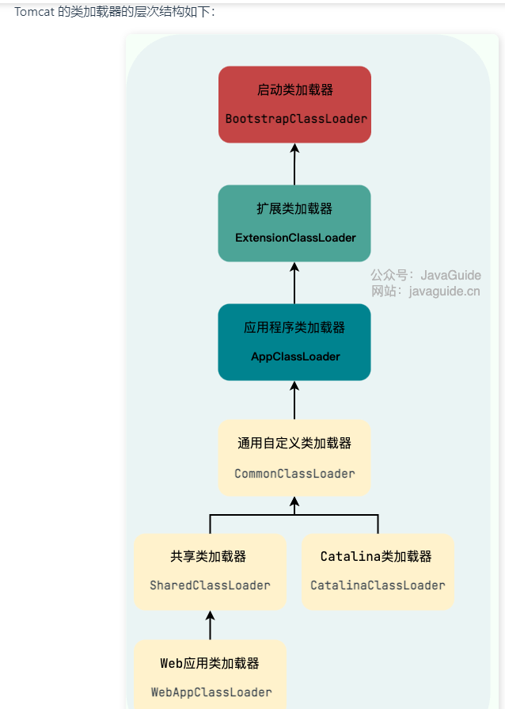


3.osgi模块化

## Java内存布局
线程共享：方法区，堆区
线程不共享：程序计数器，本地方法栈，Java虚拟机栈

堆（Heap）：这是Java虚拟机中的一块内存区域，所有线程共享。它主要用于存储对象实例和数组。堆被划分为年轻代、老年代和永久代（在JDK8中取消了永久代）。年轻代又被划分为Eden区、Survivor区（含：S0和S1）。默认情况下，年轻代和老年代的比例为1:2，即年轻代占整个堆空间的1/3，老年代占整个堆空间的2/3。

方法区（Method Area）：这也是线程共享的内存区域，主要用于存储已被虚拟机加载的类信息、常量、静态变量、即时编译器编译后的代码等数据。

虚拟机栈（VM Stack）：每个线程运行时所需要的内存称为虚拟机栈。每个栈由多个栈帧组成，对应着每次方法调用时所占用的内存，用于存储局部变量表(局部变量表中存放着基本数据类型的变量和对象的引用)、操作数栈、常量池引用等信息。

程序计数器（Program Counter Register）：用于记录下一条JVM指令的执行地址（如果正在执行的是本地方法则为空）。每一个线程都有一个程序计数器，当CPU因为时间片轮转等原因切换线程的时候，能保存当前线程的执行进度。同时，程序计数器不会存在内存溢出。

本地方法栈（Native Method Stack）：这也是线程私有的，用于支持native方法的执行。hotspot中本地方法和Java方法保存在同一个栈中


————————共享——————————————
堆区：空间最大的一块内存区域，创建出来的对象都存在于堆上，有三个参数used，total，max，分别指示了已使用，总共，最大的堆空间

方法区：包括类的基本信息（元信息），运行时常量池，字符串常量池，全部变量

在JDK1.7及以前，方法区是存放在内存空间中的永久代上；JDK1.8以后，存放在操作系统的直接内存中的元空间中

字节码文件通过编号查表的方式找到常量，这种常量池称为静态常量池；当常量池加载到内存中，可以通过内存地址快速的定位到常量池中的内容，这种常量池称为运行时常量池

字符串常量池：存储在代码中定义的常量字符串内容，比如"123"，使用+连接两个字符串变量，会导致在堆上创建对象，使用+连接两个字符串常量，会导致在编译阶段直接连接，并在字符串常量池中建立对象

JDK1.7 之前，字符串常量池存放在永久代。JDK1.7 字符串常量池和静态变量从永久代移动了 Java 堆中。

要创建直接内存上的数据，可以使用ByteBuffer
语法：ByteBuffer bf = ByteBuffer.allocateDirect（size）

## Error和Excpetion
两者的顶级父类都是throwable
Exception（异常）是应用程序中可能的可预测、可恢复问题。一般大多数异常表示中度到轻度的问题。异常一般是在特定环境下产生的，通常出现在代码的特定方法和操作中。
Exception又分为**运行时异常（Unchecked Exception）和非运行时异常（Checked Exception）**，其中非运行时异常必须进行异常捕获，否则会编译不通过
.Error（错误）表示运行应用程序中较严重问题。大多数错误与代码编写者执行的操作无关，而表示代码运行时 JVM（Java 虚拟机）出现的问题。例如，当 JVM 不再有继续执行操作所需的内存资源时，将出现 OutOfMemoryError。

## 垃圾回收机制
1.触发young gc的时机：当Eden区没有足够空间时，会触发一次Young GC

2.触发full gc的时机：
（1）调用System.gc（）
（2）在发生young gc之前，jvm会检查老年代中最大可用连续空间是否小于历代晋升到老年代的对象的平均大小，如果大于，**jdk1.6之前**那么说明没有风险，可以直接young gc，否则，会查看是否允许担保风险，如果允许那么会尝试进行young gc，此时会存在一定风险；如果不允许担保风险，那么会触发full gc。**jdk1.6之后**只要老年代中最大可用连续空间小于历代晋升到老年代的对象的平均大小，就会触发full gc

## 如何优化GC
1.尽量不要创建过大的对象或数组。
1.通过虚拟机的 -Xmn 参数适当调大新生代的大小，让对象尽量在新生代中被回收掉。
1.通过 -XX:MaxTenuringThreshold 参数调大对象进入老年代的年龄，让对象尽量在新生代中被回收掉。

## 进入老年代的时机
1.大对象直接进入老年代
2.长期存活的对象将进入老年代。对象创建时会出生在eden区，发生young gc后会被转移到survival区，之后没经过一次gc年龄都会+1，当达到指定的年龄后就会进入老年代。

## 垃圾回收器
# redis
## redis的数据类型
String，hash，List，Set，Zset
其中String的底层实现是SDS，简单动态字符串
hash的底层实现是hashmap或listpack
list的底层实现是quicklist
set的底层实现是hashmap或整数集合
zset的底层实现是listpack或跳表，zset也有map，但是map主要是为了实现更方便的单点查找，主要实现还是跳表

## 为什么用跳表而不是平衡树？
1.跳表更适合范围查询
2.跳表修改起来更为便捷
3.跳表的内存占用比平衡树要少，因为平均只需要1/(1-0.25)的指针，0.25是增加层数的概率

跳表的查询过程：要查找一个节点p，那么
从头节点的最高层查起，**如果p的权重大于最高层的下一个节点**，那么就会移动到最高层的下一个节点
如果**p的权重等于最高层的下一个节点的权重，并且p的SDS元素大于最高层下一个节点的SDS元素**，会移动到下一个节点
如果**p的权重小于最高层下一个节点的权重**，那么会移动到头节点**level数组**的下一个节点，相当于**移动到下一层**，**如果节点的下一个节点为空也会移动到下一层**
如果**p的权重等于最高层的下一个节点的权重，并且p的SDS元素小于最高层下一个节点的SDS元素**，会移动到下一个节点
移动到下一个节点后，依然是和它的下一个节点进行比较，进入上述的移动，直到找到节点为止


listpack比起压缩列表，去掉了prev字段，使得在插入时不需要多米诺骨牌似的更新prev
quicklist相当于双向链表+压缩列表，压缩列表作为值存储在节点中


## 大Key会有什么影响
1.AOF日志写回硬盘时：如果是采用的always方式，即写操作一致性完就将AOF文件写文硬盘，那么由于此时是主线程在写，所以如果修改大Key，会造成主线程长时间阻塞，但是另外两种EverySec和no不会，因为会开一个另外的子线程

2.AOF重写和RDB：（1）如果有大Key，一是开启子进程需要复制主进程的页表，如果此时页表很大，那么复制页表会耗费很长的时间 (2) 当发生写操作时，会发生写时复制，操作系统会把主线程的物理内存复制给子线程一份，此时复制物理内存也很耗时。ps：RDB发生写时复制时，子线程会依照复制的物理内存写之前的数据库，新写入的是不会写的，因此如果此时redis崩溃，会造成数据丢失

还会有如下影响：
客户端超时阻塞。由于 Redis 执行命令是单线程处理，然后在操作大 key 时会比较耗时，那么就会阻塞 Redis，从客户端这一视角看，就是很久很久都没有响应。

引发网络阻塞。每次获取大key产生的网络流量较大，如果一个key的大小是1MB，每秒访问量为1000，那么每秒会产生1000MB的流量，这对于普通千兆网卡的服务器来说是灾难性的。

阻塞工作线程。如果使用del删除大key时，会阻塞工作线程，这样就没办法处理后续的命令。

内存分布不均。集群模型在 slot 分片均匀情况下，会出现数据和查询倾斜情况，部分有大 key 的 Redis 节点占用内存多，QPS 也会比较大。

大key的解决方法：在设计阶段就拆分成小key，或者定期检查删除大key，不要用del，因为会阻塞线程，用unlink，因为这样是异步处理的

## 如何保证redis和数据库的数据一致性
旁路缓存策略：
写策略：先更新数据库，再删除缓存
读策略：命中直接返回，未命中先查询数据库，再更新缓存

对于写操作，无论是先更新数据库还是后更新数据库都有可能造成数据不一致的情况，
针对先更新数据库，再删除缓存造成的不一致，可以通过分布式锁的方式解决，或者给缓存加一个很短的过期时间
针对先删除缓存，再更新数据库造成的不一致，可以通过延迟双删解决

对于写策略，如果第二步删除缓存操作失败，那么也是造成数据不一致，要解决这个问题可以通过：
1.重试，通过消息队列，把要删除的数据放入消息队列中，当删除失败时通过消息队列进行重试
2.通过查询数据库binlog再进行相应操作

## redis单线程为什么还这么快
1.redis的操作基本都在内存中完成，比读硬盘快很多
2.redis采用的单线程模型可以避免多线程之间的竞争
3.redis采用了I/0多路复用机制处理了大量的客户端请求

redis引入多线程只是使用了多个I/O进程来处理网络请求，是为了提高I/O的并发度，但是在处理数据的时候仍然是用的单线程

## select为什么最大文件描述符数量是1024
取决于内核的参数FD_SETSIZE参数，这个参数是select中存放socket的数组大小，而进程的文件描述符最大为1024，因此select才把数组大小设计为1024

## redis的持久化
redis通过AOF日志和RDB来实现持久化。其中AOF是通过将执行命令追加到AOF日志中，在redis重启之后通过逐步执行AOF中的命令来恢复数据.AOF写回硬盘的操作有三种，1.写操作完成后立刻写回硬盘，2.每隔一秒将缓冲区的数据写回硬盘，3.由操作系统决定什么时候写回硬盘
AOF文件过大时会触发AOF重写机制，当AOF文件大小超过阈值时，redis会根据当前数据库里的数据重写AOF文件，这样就可以省去以前AOF文件里一些重复的操作，在重写AOF文件时，通常是通过一个子进程实现的，在重写的过程中，主进程仍然可以写入，不过此时除了要写入AOF缓冲区，还要写入AOF重写缓冲区，等子进程重写完毕后，再将AOF重写缓冲区里的内容追加到新的AOF文件，并替换掉新的
RDB通过快照保存了当前的数据，因此其恢复起来比AOF要快，因为只需要加载数据就可以了。

## 服务高可用
redis实现服务高可用：
1.主从复制，指定一个主节点用于写和读，其余的从节点只负责读，减缓了主节点的压力
2.哨兵，添加一个另外的监督主从节点的哨兵
3.切片集群，一个切片集群有16384个哈希槽，根据集群数量不同，每个集群分到的哈希槽数目也不同，数据会根据hash key的值通过CRC16算法得出一个16bit的值，再对16384取余分配到对应的redis集群里去

## 过期删除和内存淘汰
redis过期删除策略：惰性删除，定期删除
惰性删除：访问到键过期了才执行删除操作
定期删除：每隔一段时间抽取一部分键检查是否过期，如果过期则删除，当过期的键占被选取键的25%，会重复执行该过程，为了防止删除卡死，会为删除时间设计一个阈值，当删除时间超过这个阈值则退出删除操作

## 持久化时对过期键的处理
redis持久化时对过期键如何处理：
RDB:
1.生成持久化文件文件时：会对key进行检查，过期的key不会被保存到文件中
2.加载时：对主节点会进行检查，如果为空不会被加载到数据库，对从节点则不会进行检查，因为主从同步的时候会先删除从节点里的所有数据

AOF：
1.AOF写入阶段：如果键还没有过期，那么会先保留键，等键过期后，会追加删除语句
2.AOF重写阶段：会对过期的键进行检查，过期的键不会被写入AOF文件中

## LRU算法和LFU算法
LRU是最近最久未使用算法，由于存在需要占用额外空间，并且会造成缓存污染的情况，因此redis并没有采用
LFU是最近最少使用算法，添加了一个数据访问频次的字段

## redis的缓存设计
缓存雪崩：指短时间内大量的缓存过期，造成应用没有命中缓存转而访问数据库给数据库带来极大压力的现象，解决方法可以打乱key的过期时间或设置不过期
缓存击穿：与缓存雪崩类似，指热点缓存过期，造成数据库压力大的现象，可以通过互斥锁（同一时间只有一个线程可以访问缓存，其他未能获取锁的线程要么等待锁的释放，要么直接返回默认值或空）或者设置热点缓存不过期
缓存穿透：指短时间内访问大量缓存中也没有，数据库也没有的数据造成数据库压力大的情况，可以通过拦截非法请求，或者返回空与默认值，或者通过布隆过滤器判断有没有数据存在而不需要经过数据库

## 缓存更新策略
1.旁路缓存
2.写穿/读穿，相当于线程不与数据库交互，全权由缓存与数据库交互
3.写回，在更新数据时，先只更新缓存，标为脏数据，之后对数据库的更新会异步进行，适合写特别多的情况

## redis如何实现延迟队列
通过redis里的有序集合ZSet中的Score属性存储延时时间，并对任务进行排序实现

## 利用redis实现分布式锁
通过redis的Set命令中的NX参数，NX参数可以实现”只有键不存在时才可以插入“
如果 key 不存在，则显示插入成功，可以用来表示加锁成功；
如果 key 存在，则会显示插入失败，可以用来表示加锁失败。
```
SET lock_key unique_value NX PX 10000 
```
NX即为上面的锁，PX 10000设置过期时间为10s，防止线程持有锁太久，unique_value用来标识不同的线程，确保获得锁和释放锁都是同一个线程在进行
主要释放锁时需要两步操作：1.判断锁是否是正确的线程持有，2.删除锁，这两个是一个原子操作，因此需要配合Lua脚本实现

## 主从复制
三种主从沟通方式：
1.第一次同步，主节点会写一份RDB快照穿给从节点，在写RDB文件，传输RDB文件，子节点加载RDB文件的时候，期间的写命令会被写到replication buffer缓冲区，之后将缓冲区里的文件发给从节点完成第一次同步
2.命令传播，主节点和从节点会建立TCP长连接，期间的主节点写命令都会复制到从节点
3.增量复制，在网络断开一段时候恢复后，从节点会使用在一个环形缓冲区repl_backlog_buffer的偏移与主节点计算增量，如果数据还在缓冲区里，那么会将其写入replication buffer缓冲区由主节点发送给从节点，如果数据已经被覆盖，那么会进行全量同步

## 哨兵
哨兵通过ping的方式试探主从节点是否存活，当其发现主节点已挂的时候，1.会选出新的主节点，选取方式如下：
排除网络不好的节点——选取优先级最高的节点——选取复制进度最快的节点——选取id最小的节点
按照这个顺序选取出新的子节点
2.将所有节点指向新的主节点
3.通知客户端主节点已更换
4.将旧主节点指向新的主节点

# spring
## MVC模型
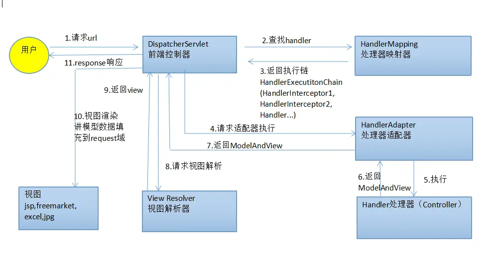
## spring事务
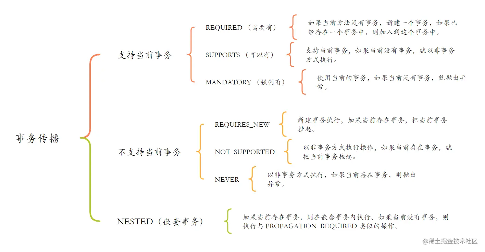
```
@RestController
public class UserController {
    private LogService logService;

    @Transactional
    public Object save(User user) {
        // 插入用户操作
        userService.save(user);
        // 插入日志
        logService.saveLog("用户插入：" + user.getName());
        return true;
    }
}

public class UserService {
    @Resource
    private UserMapper userMapper;

    @Transactional(propagation = Propagation.REQUIRED_NEW)
    public int save(User user) {
        return userMapper.save(user);
    }
}

public class LogService {
    @Resource
    private LogMapper logMapper;

    @Transactional(propagation = Propagation.NESTED)
    public int saveLog(String content) {
        // 出现异常
        int i = 10 / 0;
        return logMapper.saveLog(content);
    }
}
```
REQURES_NEW和NESTED都会开启新事务，在当前事务失败后不会影响外部事务。不同的是，REQUERES_NEW开启的**新事务可能会在外部事务完成之前进行提交**,而NESTED开启的**新事务会随着外部事务一起进行提交**。
比如UserService开启的事务是REQUIRED_NEW，那么UserService会**开启自己的新事务，并将当前事务挂起**，在完成后就会提交，在外部Controller的事务发生异常时Controller的事务回滚，但是UserService的事务已经提交了，不能回滚，这就会造成脏数据的产生
LogService开启的事务是NESTED，那么LogService也会**开启一个新事务，但是这个事务是和外部事务嵌套的**，在LogService事务完成后，它并不会马上提交，而是会和外部Controller的事务一起提交，不会造成脏数据的产生
REQUIRED_NEW的应用场景是需要进行某些独立的操作，而NESTED的应用场景是需要进行某些子操作
## Spring是如何解决的循环依赖
Spring通过三级缓存解决了循环依赖，其中一级缓存为单例池（singletonObjects）,二级缓存为早期曝光对象earlySingletonObjects，三级缓存为早期曝光对象工厂（singletonFactories）。当A、B两个类发生循环引用时，在A完成实例化后，就使用实例化后的对象去创建一个对象工厂，并添加到三级缓存中，如果A被AOP代理，那么通过这个工厂获取到的就是A代理后的对象，如果A没有被AOP代理，那么这个工厂获取到的就是A实例化的对象。当A进行属性注入时，会去创建B，同时B又依赖了A，所以创建B的同时又会去调用getBean(a)来获取需要的依赖，此时的getBean(a)会从缓存中获取，第一步，先获取到三级缓存中的工厂；第二步，调用对象工工厂的getObject方法来获取到对应的对象，得到这个对象后将其注入到B中。紧接着B会走完它的生命周期流程，包括初始化、后置处理器等。当B创建完后，会将B再注入到A中，此时A再完成它的整个生命周期。至此，循环依赖结束
解决循环依赖的核心代码：
```
/** Cache of singleton objects: bean name --> bean instance */
private final Map<String, Object> singletonObjects = new ConcurrentHashMap<String, Object>(256);
 
/** Cache of early singleton objects: bean name --> bean instance */
private final Map<String, Object> earlySingletonObjects = new HashMap<String, Object>(16);

/** Cache of singleton factories: bean name --> ObjectFactory */
private final Map<String, ObjectFactory<?>> singletonFactories = new HashMap<String, ObjectFactory<?>>(16);
//以上是三级缓存的定义

protected Object getSingleton(String beanName, boolean allowEarlyReference) {
  // Spring首先从singletonObjects（一级缓存）中尝试获取
  Object singletonObject = this.singletonObjects.get(beanName);
  // 若是获取不到而且对象在建立中，则尝试从earlySingletonObjects(二级缓存)中获取
  if (singletonObject == null && isSingletonCurrentlyInCreation(beanName)) {
    synchronized (this.singletonObjects) {
        singletonObject = this.earlySingletonObjects.get(beanName);
        if (singletonObject == null && allowEarlyReference) {
          ObjectFactory<?> singletonFactory = this.singletonFactories.get(beanName);
          if (singletonFactory != null) {
            //若是仍是获取不到而且容许从singletonFactories经过getObject获取，则经过singletonFactory.getObject()(三级缓存)获取
              singletonObject = singletonFactory.getObject();
              //若是获取到了则将singletonObject放入到earlySingletonObjects,也就是将三级缓存提高到二级缓存中
              this.earlySingletonObjects.put(beanName, singletonObject);
              this.singletonFactories.remove(beanName);
          }
        }
    }
  }
  return (singletonObject != NULL_OBJECT ? singletonObject : null);
}
```
https://pdai.tech/md/spring/spring-x-framework-ioc-source-3.html
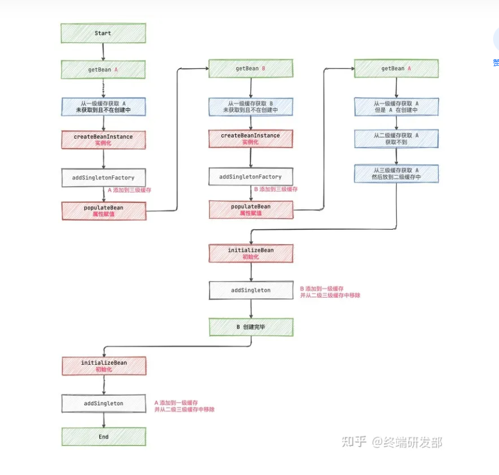

## 为什么要使用三级缓存呢？二级缓存能解决循环依赖吗
需要知道的是，在singletonFactory.getObject()这一步，如果Bean是被代理的(比如AOP代理)，那么返回的是Bean的代理对象，否则返回Bean本身

**二级缓存其实也是能解决循环依赖的**，直接放earlySingletonObject就可以了，那么为什么还要三级缓存呢？因为直接放earlySingletonObject，如果此时bean实现了代理，那么earlySingletonObject就是对应的代理对象，这时候意味着bean在实例化阶段就生成代理对象了。但是spring的设计原则应该是在实例化，属性设置和初始化之后才生成代理对象，这就违背了spring的设计原则。
如果Bean之间有循环依赖，那么提前代理无法避免，因为此时需要从缓存中获取对应的对象，这时候二级缓存三级缓存差别不大。但是如果没有循环依赖，在没有三级缓存的情况下，bean仍然需要提前代理。也就是说，**三级缓存的作用其实是使没有循环依赖的bean不会被提前代理，而是bean生命周期走完后再代理，最大程度上保证了spring的设计原则**

## @Resource和@Autowired的区别
Autowired默认bytype注入，type就是方法的变量类型，如果存在多个相同的type，那么会byName(实现类的名字)匹配(需要)，如果匹配不到，就会报错
Resource默认byName注入，如果没有相同名称则会byType进行匹配，如果匹配不到，就会报错。并且Resource是可以指定name和type的，如果使用了name就会byName匹配，如果使用了type就会byType进行匹配
如果加上@Qualifier("ClassName")，就会默认byName进行匹配，比如
```
public class CookPatato implements Cook
@Autowired
@Qualifier("CookPatato")
```
而@Resource还可以指定name：
```
1.@Resource(name="CookPatato")

2.@Resource
  @Qualifier("CookPatato")
```
还可以通过在实现类上加@Primary指定优先注入
```
@Primary
public class CookPatato implements Cook
```
## 依赖注入的原理
1.通过依赖类的构造函数注入
2.通过依赖类的setter函数注入
3.通过依赖类实现接口的方式
```
public interface BoyInjection {

    void inject(Boy boy);
}
public class Classes implements BoyInjection {
    //....

    private Boy boy;

    @Override
    public void inject(Boy boy) {
        //实现接口中的方法
        this.boy = boy;
    }
}
```
4.通过字段@Autowired或者@Resource注入
## bean的生命周期
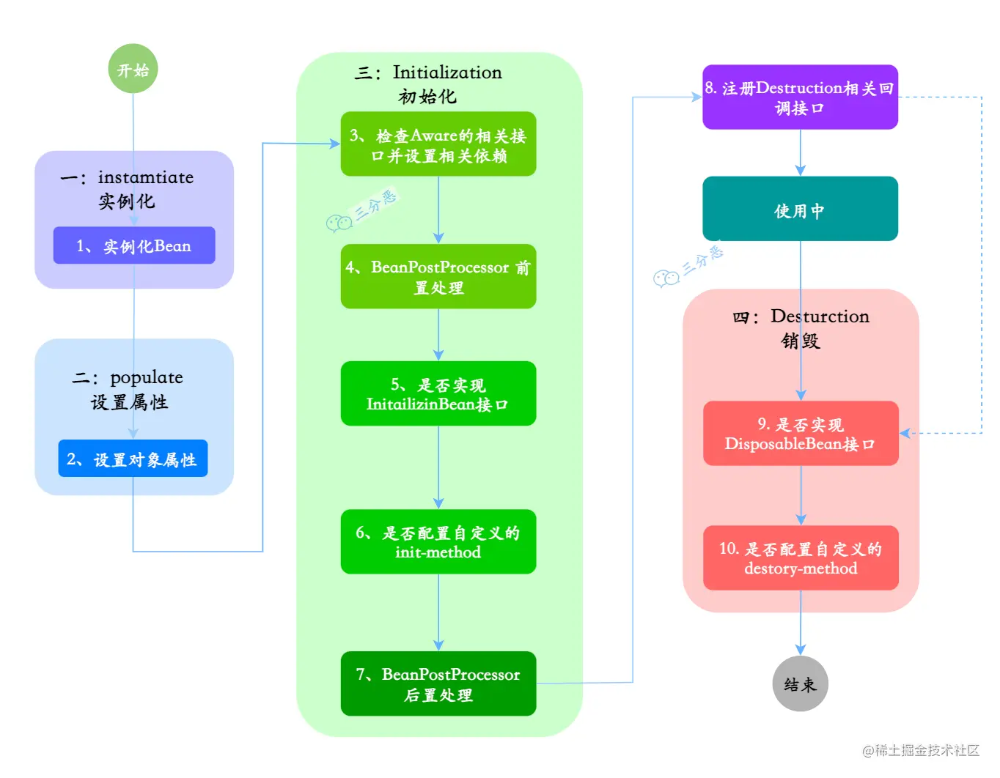
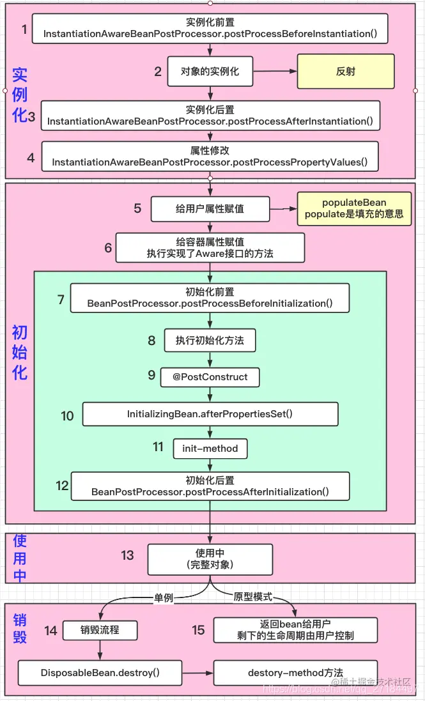
populate中的对象属性为bean对象持有的其他自定义bean，如User，Service等
Aware相关接口用于获取相关资源，如果第2步中bean属性实现了相关的Aware接口，那么就会调用相关Aware接口执行set方法，比如**实现了BeanFactoryAware方法，那么就会执行setBeanFactory**
bean前置处理和bean后置处理为**执行初始化前后的自定义操作**
InitailizingBean为初始化方法，有@PostConstruct,InitializingBean.afterPropertiesSet(),和init-method().其中，**PostConstruct会在构造函数之后，init函数之前执行（如果有）**，**afterPropertiesSet()会在PostConstruct之后，init-method之前执行**
**init-method用来在bean初始化的时候执行指定方法，比如数据库连接之类的**
在销毁阶段，如果bean是单例模式，那么会先调用**DisposableBean.destory()**，然后调用**destory-method**
```
public class InitMethod  {
 
    // 在@Bean注解上添加initMethod属性，指向类中的 initMethod_1 执行初始化方法
    // 在@Bean注解上添加destroyMethod属性，指向类中的 destroyMethod_1 执行销毁方法
    @Bean(initMethod = "initMethod_1",destroyMethod = "destroyMethod_1")
    public BeanTest getBeanTest(){
        return new BeanTest();
    }
}
BeanTest.java

package com.Spring.Boot.init.bean;
 
public class BeanTest {
 
    // 将要执行的初始化方法
    public void initMethod_1(){
        System.out.println("我是beanTest的init方法");
    }
 
    // 将要执行的销毁方法
    public void destroyMethod_1(){
        System.out.println("我是beanTest的init方法");
    }
 
 
}
```
如果是原型模型，那么会返回bean给用户由用户处理。原型模式是指通过深拷贝的方式创建一个重复的对象，这种模式是实现了一个原型接口，该接口用于创建当前对象的克隆。当直接创建对象的代价比较大时，则采用这种模式。
## bean会有线程安全问题吗
todo

## AOP
### AOP的一些术语
面向切面编程，目的是把一部分类的共同动作抽象出来，完成对类的解耦。OOP的核心思想是封装，AOP的核心思想是解耦。OOP面向对象编程，针对业务处理过程的实体及其属性和行为进行抽象封装，以获得更加清晰高效的逻辑单元划分。而AOP则是针对业务处理过程中的切面进行提取，它所面对的是处理过程的某个步骤或阶段，以获得逻辑过程的中各部分之间低耦合的隔离效果。
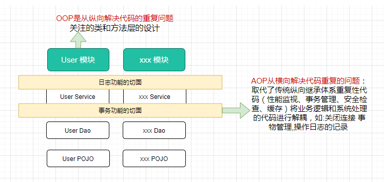
AOP的几个术语
连接点（Jointpoint）：表示需要在程序中插入横切关注点的扩展点，连接点可能是类初始化、方法执行、方法调用、字段调用或处理异常等等，Spring只支持方法执行连接点，在AOP中表示为**在哪里干**；**指单个方法**

切入点（Pointcut）： **选择一组相关连接点的模式，即可以认为连接点的集合**，Spring支持perl5正则表达式和AspectJ切入点模式，Spring默认使用AspectJ语法，在AOP中表示为在哪里干的集合；**其实就是指方法，在切入点切入=在方法中切入**

通知（Advice）：在连接点上执行的行为，通知提供了在AOP中需要在切入点所选择的连接点处进行扩展现有行为的手段；包括前置通知（before advice）、后置通知(after advice)、环绕通知（around advice），在Spring中通过代理模式实现AOP，并通过拦截器模式以环绕连接点的拦截器链织入通知；**在AOP中表示为干什么**；**就是要在方法里切入什么功能，指许多方法的集合**

方面/切面（Aspect）：横切关注点的模块化，比如上边提到的日志组件。可以认为是通知、引入和切入点的组合；在Spring中可以使用Schema和@AspectJ方式进行组织实现；在AOP中表示为在哪干和干什么集合；引入（inter-type declaration）：也称为内部类型声明，为已有的类添加额外新的字段或方法，Spring允许引入新的接口（必须对应一个实现）到所有被代理对象（目标对象）, 在AOP中表示为干什么（引入什么）；**其实就是切入点+通知的集合**

目标对象（Target Object）：需要被织入横切关注点的对象，即该对象是切入点选择的对象，需要被通知的对象，从而也可称为被通知对象；由于Spring AOP 通过代理模式实现，从而这个对象永远是被代理对象，在AOP中表示为对谁干；

织入（Weaving）：把切面连接到其它的应用程序类型或者对象上，并创建一个被通知的对象。这些可以在编译时（例如使用AspectJ编译器），类加载时和运行时完成。Spring和其他纯Java AOP框架一样，在运行时完成织入。**在AOP中表示为怎么实现的**；**怎么实现AOP功能的**

AOP代理（AOP Proxy）：AOP框架使用代理模式创建的对象，从而实现在连接点处插入通知（即应用切面），就是通过代理来对目标对象应用切面。在Spring中，AOP代理可以用JDK动态代理或CGLIB代理实现，而通过拦截器模型应用切面。在AOP中表示为怎么实现的一种典型方式；

### 几个通知类型
前置通知（Before advice）：在某连接点之前执行的通知，但这个通知不能阻止连接点之前的执行流程（除非它抛出一个异常）。**方法执行前通知**

后置通知（After returning advice）：在某连接点正常完成后执行的通知：例如，一个方法没有抛出任何异常，正常返回。**方法执行完毕后通知**

异常通知（After throwing advice）：在方法抛出异常退出时执行的通知。

最终通知（After (finally) advice）：当某连接点退出的时候执行的通知（不论是正常返回还是异常退出）。

环绕通知（Around Advice）：包围一个连接点的通知，如方法调用。这是最强大的一种通知类型。环绕通知可以在方法调用前后完成自定义的行为。它也会选择是否继续执行连接点或直接返回它自己的返回值或抛出异常来结束执行。**在方法整个执行周期，包括前后的通知**

### 一个AOP的实验
todo

### 几个AOP的实现方式
1.基于AspectJ
2.基于代理模式：详见设计模式中的代理模式章节

# mq
## mq消息丢失问题
mq消息丢失可能存在三种可能，生产者端丢失，mq丢失，消费者取到了消息但还没处理造成的丢失
针对生产者端：1.开始rabbitMQ的事务机制，在发送数据之前开启事务，如果消息没被mq接收到生产者端会报错，此时可以回滚事务然后重发消息，如果收到了消息就可以提交事务
2.使用confirm机制，confirm机制和事务最大的不同就是它是异步的。开启confirm机制后，每个消息会有一个独特的id，mq收到消息后会返回一个ack，如果没有收到消息会回调nack接口告知发送失败，这时可以尝试重发；同时，因为每个消息都有唯一的id，因此在一段时间后没有收到ack，生产者端可以自己重发消息

针对mq端：对mq的消息持久化到硬盘上

针对消费者端：使用raabitmq的ack机制，先关掉mq的自动ack，在消息处理完之后在代码里手动ack。这里的ack是由消费者发送到mq的，与生产这段的ack不同。
## mq重复消费问题
mq不处理重复消费问题，通常是在业务代码里自行处理。要求实现幂等性，seckill里是通过用户id+商品id的唯一索引实现

# 网络
## 浏览器敲下URL发生了什么？
DNS 解析：当用户输入一个网址并按下回车键的时候，浏览器获得一个域名，而在实际通信过程中，我们需要的是一个 IP 地址，因此我们需要先把域名转换成相应 IP 地址。

TCP 连接：浏览器通过 DNS 获取到 Web 服务器真正的 IP 地址后，便向 Web 服务器发起 TCP 连接请求，通过 TCP 三次握手建立好连接。

建立TCP协议时，需要发送数据，发送数据在网络层使用IP协议， 通过IP协议将IP地址封装为IP数据报；然后此时会用到ARP协议，主机发送信息时将包含目标IP地址的ARP请求广播到网络上的所有主机，并接收返回消息，以此确定目标的物理地址，找到目的MAC地址；

IP数据包在路由器之间，路由选择使用OPSF协议， 采用Dijkstra算法来计算最短路径树，抵达服务端。
发送 HTTP 请求：建立 TCP 连接之后，浏览器向 Web 服务器发起一个 HTTP 请求（如果是HTTPS协议，发送HTTP 请求之前还需要完成TLS四次握手）；

处理请求并返回：服务器获取到客户端的 HTTP 请求后，会根据 HTTP 请求中的内容来决定如何获取相应的文件，并将文件发送给浏览器。

浏览器渲染：浏览器根据响应开始显示页面，首先解析 HTML 文件构建 DOM 树，然后解析 CSS 文件构建渲染树，等到渲染树构建完成后，浏览器开始布局渲染树并将其绘制到屏幕上
## TCP
### 为什么需要time-wait
1.防止历史连接中的数据被后面相同的四元组接受造成数据的错乱
2.确保被连接端可以正确关闭，因为连接端的ACK可能会丢失，此时为了接收到被连接端最后的fin报文，所以需要等待2msl的时间(ACK过去一个msl，fin过来一个msl)

### time-wait过多的危害
1.文件描述符占用，得不到释放，占用cpu资源，内存资源，线程资源
2.端口资源被占用，对于客户端来说，相同的源端口和目标端口的连接是有限的，过多的time-wait会使得无法建立相同的源端口和目标端口，但是不同的相同的源端口去连接不同目标端口还是可以连接的

### 为什么会出现过多的time-wait
1.连接方式采用的短连接，执行完一个请求就进入time-wait状态
2.长连接超时。客户端超过一定时间没有发起请求，服务端断开连接
3.HTTP 长连接的请求数量达到上限。Web 服务端通常会有个参数，来定义一条 HTTP 长连接上最大能处理的请求数量，当超过最大限制时，就会主动关闭连接。比如nginx 的 keepalive_requests 这个参数，这个参数是指一个 HTTP 长连接建立之后，nginx 就会为这个连接设置一个计数器，记录这个 HTTP 长连接上已经接收并处理的客户端请求的数量。keepalive_requests 参数的默认值是 100 ，意味着每个 HTTP 长连接最多只能跑 100 次请求，这个参数往往被大多数人忽略，因为当 QPS (每秒请求数) 不是很高时，默认值 100 凑合够用。但是，对于一些 QPS 比较高的场景，比如超过 10000 QPS，甚至达到 30000 , 50000 甚至更高，如果 keepalive_requests 参数值是 100，这时候就 nginx 就会很频繁地关闭连接，那么此时服务端上就会出大量的 TIME_WAIT 状态。


### 连接过多时会发生什么
在tcp全连接队列满之后，会采取两种策略，一种是丢弃ACK，一种是向客户端发送reset终止当前连接。一般会采取第一种策略，因为如果服务器只是短暂繁忙，那么当tcp全连接队列有空位时，由于客户端会重发ACK，那么此时可以重新连接，有助于应对突发流量
## HTTP
### http的状态码
2xx表示成功，
3xx表示重定向，301 Moved Permanently表示永久重定向，需要用新的url访问， 302 Found表示资源还在，但是暂时需要用另一个url进行访问。301，302都会在响应头里加上location字段，会由浏览器自动进行跳转。304 Not modified不会跳转，表示资源没有更改可以使用缓存
4xx表示客户端异常，403 Forbidden表示服务器禁止访问，404 Not Found表示服务器上不存在请求的资源
5xx表示服务端异常，501 Not Implemented表示服务端暂时还未实现该功能，502 Bad Gateway表示服务器工作正常，但是访问服务器出了问题，503 Service Unavailable 表示服务器当前忙
### http的报文格式
host:用来指定服务器的域名
content-length：用来指定报文的长度
connection:用来指定是否是长连接，如果为keep-alive就是长连接
content-type：用来表明本次发送的数据的格式
accept：表示可以接受的数据格式
content-encoding：表示数据所使用的压缩格式

### TLS握手过程
1.客户端会发送Client Hello报文（里面包含TLS版本，加密套件，**第一随机数**）
2.服务器会发送Server Hello报文（包含了TLS版本，加密套件，**第二随即数**），还会发送服务器的证书（如果要求客户端的证书会在这一步请求），然后把自己的**公钥**发给客户端，结束后发送Server Hello done
3.客户端收到公钥后，会生成一个**预主密钥**，预主密钥**经过公钥加密**以后发送给服务端，服务端收到后用自己的私钥解密，也可以得到预主密钥
4.客户端使用**第一随机数，第二随机数，预主密钥**生成会话密钥，发送**Change Cipher Spec**告诉服务端开始加密对话，同时将之前的数据都打包做摘要，用会话密钥加密，发送**Encrypted Handshake Message（Finishd）**消息
5.服务端同样也会发送**Change Cipher Spec**，**Encrypted Handshake Message（Finishd）**消息.
6.之后，服务端和客户端开始用会话密钥进行对称加密通话
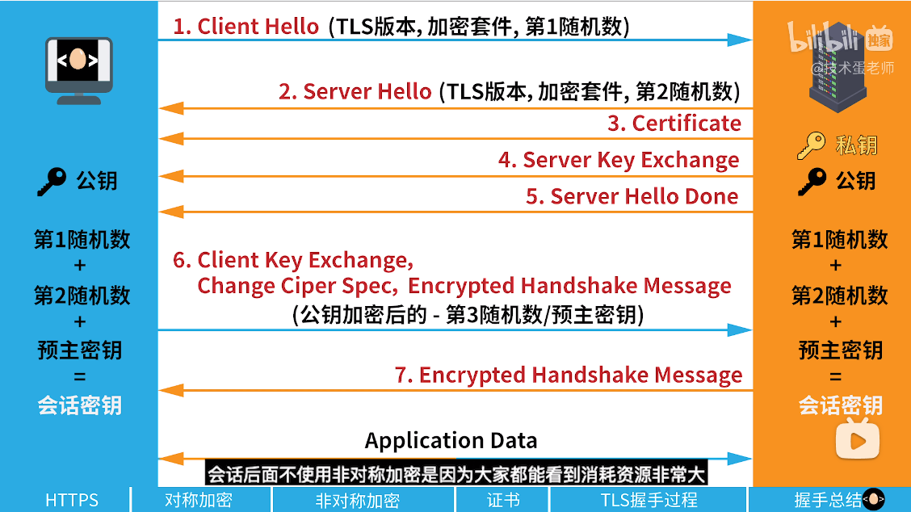

以上是RSA的过程，如果是ECDHE，那么用于生成会话密钥的**预主密钥**会被替换为ECDHE算法计算出的密钥x。x是这么计算的：
服务器再server key exchange这一步，会选取椭圆曲线基点G，还会**生成一个随机数作为自己的私钥**，私钥和G一起计算出**服务端的椭圆曲线公钥**，随和G和服务端公钥会发送给客户端，客户端收到后会用G和一个随机数生成自己的**客户端公钥和私钥**，然后再在client key exchange这一步把公钥发送给服务端，自此，服务端，客户端都有了G，自己的私钥和对方的公钥，可以计算出一个公共的数**x**，最后的**会话密钥**就是用**第一随机数+第二随机数+x生成的（没错，第一随机数和第二随机数就是上面的那个，自己的私钥和公钥是额外加进来的）**
### 数字签名和CA数字证书
CA对数字证书进行数字签名的过程如下：
CA收到网站的信息和公钥以后，会对**这些信息和公钥一起**进行哈希运算（目的是为了压缩数据），之后，CA会生成**一对独特的公钥和私钥**，并使用私钥对这一串哈希字符进行加密（**加密后的字符就叫数字签名**），之后CA会把带有数字签名的数字证书发给服务端。服务端把数字证书发给客户端，客户端会**使用CA的公钥对数字签名进行解密**得到一串哈希字符，之后再对数字证书里的内容进行哈希运算得到**另一串哈希字符**，如果前后两串哈希字符相等，说明是可以信任的。（如果数字证书被篡改，由于中间人没有原本生成数字签名的私钥，所以用CA的公钥去解密是匹配不上的，也就是前后得到的哈希字符串会不一致）。为了防止CA的公钥可靠，CA也需要证明自己的身份，需要有根CA的签名，这一过程由CA的上级CA也就是根CA完成，而根CA是自己给自己签名的
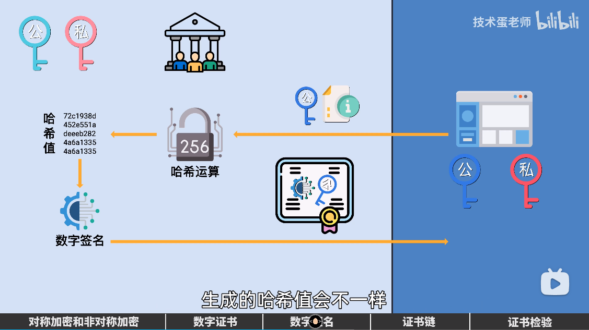
### websocket
websocket协议用于客户端和服务器之间大量互相传输消息，建立websocket连接需要在http里加上upgrade请求升级协议，客户端会发一个websocket-key给服务端，服务端收到后通过一个公开的加密算法对websocket-key进行加密再传输给客户端，客户端收到后用同样的算法对websocket加密，如果二者一致则连接建立成功
websocket的opcode用来指定这是什么类型的帧，websocket的帧是由帧长度+帧数组组成的，为了知道具体的帧数据大小，一开始会读前7个比特，如果其值在0~125，则说明第一个7bit的payload长度就够用，如果为126，那么还需要往后读16个比特的payload，如果为127，那么需要往后读64个比特的payload（16+32+16）
# Mysql
## mysql的扫描类型
All（全表扫描）；
index（全索引扫描）；
range（索引范围扫描）；
ref（非唯一索引扫描）；
eq_ref（唯一索引扫描）；
const（结果只有一条的主键或唯一索引扫描）。
执行效率依次从低到高

## mysql的优化思路
前缀索引优化，对记录的几个前缀建立索引，减少索引字段的大小，使一个索引页面能够容纳下更多的索引项
覆盖索引优化，使查询中的字段在二级索引中都能找得到，避免回表
主键索引最好自增，避免插入中间的键值引起页面的分裂
主键不应太大，否则其他的索引也会很大
优化查询语句，防止索引失效
索引最好设置为NOT NULL
大数据量查询时limit优化，最好加上无序查询，这样可以避免数据库排序所耗费的时间

## 索引失效的原因
1.使用了左模糊查询或者左右模糊查询
2.对索引使用了函数
3.对索引使用了表达式运算
4.索引进行了隐式类型转换 （mysql会把字符串转为其他类型，当索引为字符串时相当于把索引强转为了其他类型，建立的索引就失效了）
5.联合索引进行了非最左匹配
6.使用了or或者in

## Myisam和innodb引擎的区别
1.innodb支持事务，而myisam不支持
2.innodb支持外键，而myisam不支持
3.innodb是聚簇索引，其主键索引和数据是放在一起的，二级索引里存放的是主键的值；而myisam是非聚簇索引，不论是主键索引还是二级索引，存放的都是数据文件的指针
3.innodb必须有唯一索引，而myisam可以没有
4.innodb不保存表的具体行数，执行select count时需要扫描全表，这是因为innodb支持事务，不同事物看到的表的行数是不一样的；而myisam有一个全局字段保存表的行数
5.innodb支持行级锁，而myisam仅支持表级锁
6.innodb不支持全文索引，myisam支持全文索引
## 数据库的四大特性
原子性：所有操作必须同时执行成功
数据一致性：事务操作前和操作后数据库里的数据满足完整性约束，保证一致
隔离性：多个事务可以并发的对数据库进行操作而不会相互制约
持久性：事务对数据库的改变是永久的

实现原理：原子性是通过undo log实现的，持久性是通过redo log实现的，隔离性是通过MVCC实现的，数据一致性是通过原子性+持久性+隔离性实现的

## 索引下推
对索引的判断在存储引擎完成，而不用在服务层完成

## 聚簇索引的特点
1.唯一性：一个表中只有一个聚簇索引
2.数据物理顺序：
3.主键默认：聚簇索引默认是主键，如果没有主键，会定义一个唯一且非空的索引作为聚簇索引，如果没有这样的索引，那么会自动创建一个索引
4.快速查询：聚簇索引中包含所有所有的数据，因此可以减少一次查询，（不用回表？）
5.范围查询优化：聚簇索引中，数据按顺序排在数据页上，相同值也排在一起，因此在进行范围查询比如group by 或者 order by的时候可以不用进行大范围查询
6.覆盖索引扫描

## 慢sql
当sql和索引都没有问题时的解决思路：
1.增加缓存，将一些热点数据放到redis里
2.分表
3.在读多写少的情况下可以采用主从复制
4.分库

如何保证redis里都是热点数据：利用redis的LRU算法，选择合适的LRU算法
allkeys-lru：从所有键中选择最近最少使用的键淘汰
volatile-lru：从设置了过期时间的所有键中选择最近最少使用的键淘汰

## mysql一张表能存储多少数据
mysql一页的大小为16KB，如果一条记录的大小为1KB，那么可以存16条记录。可以存放的记录多少是由页的大小和记录大小共同决定的。**但是如果对于varchar，text这种类型的行在长度达到768byte后，会将前768byte作为前缀，多出来的数据溢出会存到溢出页中，然后通过一个偏移量指针将二者关联起来**
## sql如何分页，limit如何分页
分页使用limit实现，不同的页数根据关键字offset实现

## mysql的锁机制
从粒度大小分可以分为全局锁、表级锁和行级锁

而表级锁又可分为表锁、元数据锁、意向锁和AUTO-INC锁
表锁：可将整个表锁住，限制包括本进程在内的所有进程的读写，粒度较大，影响性能
元数据锁：自动加上的锁，进行CRUD操作时会加上MDL读锁，进行表结构改变的时候会加上MDL写锁，其中读锁和读锁之间不互斥，读锁写锁互斥并且写锁的优先级在读锁之上，当写锁阻塞时候，后续的读锁也会一起阻塞
意向锁：在对记录加上独占锁之前，需要先取得意向独占锁；在对记录加上共享锁之前，需要先取得意向共享锁。意向共享锁是用来快速判断表里是否有记录被加锁，如果没有意向锁，在给表加独占表锁时，需要遍历每一条记录，查看记录是否存在独占锁，而有了意向锁，只需要查看表里有无意向锁，这样就可以不用去遍历所有记录。
AUTO-INC锁：在插入数据时会加一个表级别的AUTO-INC锁，随后为被auto-increment修饰的字段自增1，在持有AUTO-INC锁的时候，其他事务的插入操作会被阻塞，从而保证了auto-increment修饰的字段能够正确递增。AUTO-INC锁是在语句执行完毕之后才释放的（ innodb_autoinc_lock_mode = 0），也可以设置参数 innodb_autoinc_lock_mode = 2来使申请自增后就释放锁，而不必等到语句执行完毕。但是这样存在的风险是可能使同一个会话的插入值主键不连续，从而使得主库从库不一致（从库只会执行完一个会话的插入后再执行另一个，此时是连续的），此时可以设置binlog日志的格式为row，从而使主从库的主键值一致

行级锁分为记录锁，间隙锁，和next-key锁，next-key是前两者的结合，它即锁住了一个区间，也锁住了一个点（左开右闭区间），还有插入意向锁。
插入意向锁与意向锁类似，如果记录插入位置已经被加了间隙锁，那么它会先阻塞，并在此期间生成一个插入意向锁（只是生成），并将锁设为等待状态，只有当前一个事务提交后，锁才会变为正常状态，值得注意**意向锁只是会提前生成，而不是生成之后就分配给事务。也就是说意向锁与间隙锁是互斥的，不可能一个事务持有间隙锁，一个事务持有意向锁，只有等持有间隙锁的事务提交之后，意向锁才会被分配到相应事务**
加行级锁的情况：使用锁定读
```
//对读取的记录加共享锁(S型锁)
select ... lock in share mode;

//对读取的记录加独占锁(X型锁)
select ... for update;
```
或者进行update和delete操作时会加上行级锁，加锁的基本单位是next-key锁，但是某些情况可能退化为间隙锁或者记录锁，这个要具体情况具体分析。
如果是对非唯一索引加锁，那么加锁之后能否插入二级索引值相同的记录，还要看其插入的范围，因为在锁定二级索引的同时也会锁定对应的主键。比如二级索引的间隙锁范围为（22，39），对应的主键值为10，20.那么能否插入二级索引为22，39的值得还需要看其主键的值，如果插入为（3，22）的值，那么可以插入成功，因为它不在间隙锁范围内，同理（12，22）就不能成功插入，因为它在间隙锁范围内
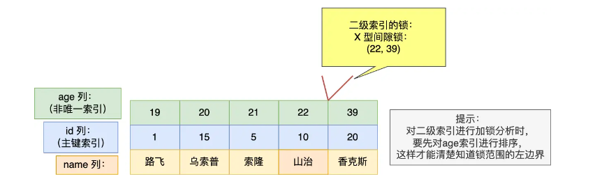
## mysql的五种数据类型
整型，浮点数类型，字符串类型，日期类型，二进制类型
## mysql进行范围查询时的过程
通过二分查找加载满足第一个叶子节点页到内存，在表中通过二分查找找到一一条满足要求的数据，之后通过页内链表和叶间链表不断查询，直到找到一条不满足要求的数据。

## redolog和binlog是怎么保持数据一致性的
通过两阶段提交。数据库会开启一个内部事务XA，会先往redolog里写入事务的id XID，之后将redolog刷盘（**prepare阶段，此时redolog的事务状态被设置为prepare**），然后将XID写入binlog，进行binlog的刷盘，完成后，**将redolog的事务状态设置为commit**。

如果发生异常，那么会先顺序扫描redolog文件，当发现处于prepare阶段的redolog时，会去扫描binlog，如果在binlog里发现了XID，那么说明redolog和binlog都已经完成刷盘，可以提交事务；如果没有发现XID，那么说明redolog刷盘了但是binlog没有刷盘，此时需要进行回滚

## 各种刷盘时机比较
### redolog
MySQL 正常关闭时；

当 redo log buffer 中记录的写入量大于redo log buffer内存空间的一半时，会触发落盘；

InnoDB 的后台线程每隔 1 秒，将 redo log buffer 持久化到磁盘。

每次事务提交时都将缓存在redo log buffer里的redo log直接持久化到磁盘，这个策略可由 innodb_flush_log_at_trx_commit 参数控制，

当设置该参数为0时，表示每次事务提交时，还是将redo log留在redo log buffer中 ，该模式下在事务提交时不会主动触发写入磁盘的操作。
当设置该参数为1时，表示每次事务提交时，都将缓存在redo log buffer里的redo log直接持久化到磁盘，这样可以保证MySQL异常重启之后数据不会丢失。
当设置该参数为2时，表示每次事务提交时，都只是缓存在redo log buffer里的redo log写到redo log文件，注意写入到「redo log 文件」并不意味着写入到了磁盘，因为操作系统的文件系统中有个 Page Cache，Page Cache 是专门用来缓存文件数据的，所以写入「redo log文件」意味着写入到了操作系统的文件缓存。
### binlog
MySQL提供一个 sync_binlog 参数来控制数据库的binlog刷到磁盘上的频率：

sync_binlog=0的时候，表示每次提交事务都只write，不fsync，后续交由操作系统决定何时将数据持久化到磁盘；
sync_binlog=1的时候，表示每次提交事务都会write，然后马上执行fsync；
sync_binlog =N(N>1)的时候，表示每次提交事务都write，但累积N个事务后才fsync。

### AOF
在 redis.conf配置文件中的appendfsync配置项可以有以下 3 种参数可填：

Always，这个单词的意思是「总是」，所以它的意思是每次写操作命令执行完后，同步将AOF日志数据写回硬盘；

Everysec，这个单词的意思是「每秒」，所以它的意思是每次写操作命令执行完后，先将命令写入到 AOF 文件的内核缓冲区，然后每隔一秒将缓冲区里的内容写回到硬盘；

No，意味着不由Redis控制写回硬盘的时机，转交给操作系统控制写回的时机，也就是每次写操作命令执行完后，先将命令写入到 AOF 文件的内核缓冲区，再由操作系统决定何时将缓冲区内容写回硬盘。

# 分布式
## 分布式id生成方法
1.数据库主键自增
2.数据库号段分配
3.uuid算法
4.雪花算法

## 负载均衡
### 不同的负载均衡方向
客户端负载均衡：
客户端会自己维护一份服务器地址列表，发送请求前，客户端会根据负载均衡算法选择一台具体的服务器处理请求

服务端负载均衡：
通常由一层、两层、四层、七层负载均衡
其中四层和七层最常见，四层工作在传输层，七层工作在应用层
七层负载均衡常见的两种有：**DNS解析、反向代理**
**DNS解析指的是**在DNS服务器中为同一个主机域名配置多个IP地址，这些IP地址对应了不同的服务器，用户请求解析域名时，根据轮询的方式返回一个IP地址
**反向代理**指的是用一个反向代理服务器来处理客户端的请求，由反向代理服务器来选择具体的服务器处理请求并返回给客户端结果。由于反向代理服务器此时是代替服务器进行请求处理，相当于把服务器隐藏了，因此称之为”反向代理“。与之相对的是正向代理，是指代理服务器代替客户端发送请求，此时对于服务端而言客户端被隐藏了，因此被称为正向代理。

### 负载均衡常见的算法
**1.随机法**
随机选择一个服务器进行服务，但是可能存在某些服务器空闲时间过久的弊端
**2.轮询法**
按照次序依次询问服务器，分为**加权轮询和不加权轮询**，不加权轮询指的是每个服务器都会按照次序逐一被分配请求，适合每个服务器负载能力相同的服务器集群；加权轮询指的是给某些负载能力较强的服务器赋予较大的权重，以使得它们能分配到更多请求
**3.两次随机法**
跟随机法类似，只不过是选出两个随机的服务器，从中选择一个
**4.哈希法**
通过哈希函数映射到服务器上，弊端是当有服务器变动时哈希结果会变化，造成大规模的数据迁移
**5.一致性哈希**
将服务器节点遍布在一个固定的圆盘上，这样就算有服务器变动，受影响的也只有变更服务器的顺时针上的下一个服务。而且可以通过添加虚拟节点的方式使负载更加均衡
**6.最小连接法**
选择连接数最少的服务器，但是连接数少不一定代表负载小，可能某些连接负载会很大
**7.最少活跃法**
和最小连接法类似，只不过最少连接法选择的是**活动最小连接数**最少的服务器
**8.最快响应法**
客户端会维持每个服务器的响应时间，会从中选择一个响应事件最短的服务器

# Seckill秒杀系统
## 解决库存超卖问题
单纯在减库存时判断商品库存是否为负，为负不再继续，解决超卖。
```
boolean seckillGoodsResult = itSeckillGoodsService.update(new UpdateWrapper<TSeckillGoods>()
.setSql("stock_count = " + "stock_count-1")
.eq("goods_id", goodsVo.getId())
.gt("stock_count", 0)
);
if (!seckillGoodsResult) {
    return null;
}
```

另外的方案：加Redisson分布式锁 或者 查询库存时使用 for update进行加锁

## 减少sql访问
1.通过redis库存预减减少对mysql的访问
redis库存预减必须实现原子性，不然可能会导致redis缓存中的库存发生超卖的现象，超卖的订单还是会走数据库，加大数据库压力。这里是通过redis+Lua脚本实现的
为什么Lua可以实现防止redis缓存中的库存发生超卖：如果有很多个请求同时执行 Lua 脚本，Redis 会依次执行这些请求，确保每个 Lua 脚本的原子性。**当一个 Lua 脚本执行完毕后，才会去执行下一个 Lua 脚本**，这样可以保证每个 Lua 脚本的操作都是原子的，不会被其他请求打断。由于每一个秒杀请求读取库存和扣减库存都是在Lua脚本里执行的，因此不会出现多个请求读取到同一个库存数然后递减导致的库存超卖问题

2.通过内存标记减少对redis的访问

## 解决重复抢购问题
这里的幂等性定义为下过单以后无论多少次点击也无法重复下单
1.通过读取缓存订单
2.对秒杀订单简历id+商品id的唯一索引，在生成订单前开启事务，如果存在相同索引订单会抛出异常，造成事务的回滚

## 如何解决少卖问题
当同一个用户重复下单，当还没有生成订单的时候，每一次下单Redis库存就会减少一个，那么当mysql中订单重复的时，mysql会回滚，但是redis已经扣减的库存不会回滚，后面的请求订单因为redis中库存不足也无法成功下单，就造成了mysql中的库存会卖不完，造成少卖现象。这种情况可以将redis中的库存多设置一点，比如说库存有10个，那么redis里面的库存可以设置为20个，一定程度上可以减少少买现象的发生

https://www.cnblogs.com/xiangkejin/p/9351501.html 关于秒杀优化总结的一篇博文
# Linux
查看cpu使用率：1.top   2.cat /proc/loadavg

查看内存:free

查看日志:tail,往后看多少日志，例如
tail  -n  10   test.log   查询日志尾部最后10行的日志;
tail  -n +10   test.log   查询10行之后的所有日志;
tail  -fn 10   test.log   循环实时查看最后10行记录(最常用的)
一般还会配合grep一起用，比如  tail -fn 1000 test.log | grep '关键字'
如果想要翻页查看，那么使用more：tail -n 4700  aa.log |more -1000 可以进行多屏显示(ctrl + f 或者 空格键可以快捷键)

head，于tail相反，往前看
head -n  10  test.log   查询日志文件中的头10行日志;
head -n -10  test.log   查询日志文件除了最后10行的其他所有日志;

less,与more类似，但是比more更加灵活，可以向上向下翻页
一般的查找流程：
less log.log
shift + G 命令到文件尾部  然后输入 ？加上你要搜索的关键字例如 ？1213
按 n 向上查找关键字
shift+n  反向查找关键字


查找关键字:grep

报告进程：ps(ps -ef|grep xxx)

# OS
## 进程与线程区别
本质区别：进程是操作系统资源分配的基本单位，而线程是任务调度和执行的基本单位

在开销方面：每个进程都有独立的代码和数据空间（程序上下文），程序之间的切换会有较大的开销；线程可以看做轻量级的进程，同一类线程共享代码和数据空间，每个线程都有自己独立的运行栈和程序计数器（PC），线程之间切换的开销小

稳定性方面：进程中某个线程如果崩溃了，可能会导致整个进程都崩溃。而进程中的子进程崩溃，并不会影响其他进程。

内存分配方面：系统在运行的时候会为每个进程分配不同的内存空间；而对线程而言，除了CPU外，系统不会为线程分配内存（线程所使用的资源来自其所属进程的资源），线程组之间只能共享资源

包含关系：没有线程的进程可以看做是单线程的，如果一个进程内有多个线程，则执行过程不是一条线的，而是多条线（线程）共同完成的；线程是进程的一部分，所以线程也被称为轻权进程或者轻量级进程
## 零拷贝
零拷贝指的是减少数据在缓冲区之间的拷贝次数以及系统调用的次数。

传统模式下：发起read调用，DMA拷贝到内核缓冲区，CPU将内核缓冲区内容拷贝到用户空间；发起write调用，CPU将用户空间拷贝到socket缓冲区，DMA将socket缓冲区内容拷贝到网卡。会进行**4次拷贝，2次系统调用，4次上下文切换**

mmap+write：发起read调用，DMA拷贝到内核缓冲区，此时，**应用程序和内核共享这个缓冲区**，之后发起write调用，会将内容从内核缓冲区拷贝到socket缓冲区(CPU)，DMA将socket缓冲区拷贝到网卡，会进行**3次拷贝，2次系统调用，4次上下文切换**

sendfile：发起sendfile调用，DMA拷贝到内核缓冲区，**内核缓冲区会拷贝到socket缓冲区(CPU)**，DMA将socket缓冲区内容拷贝到网卡，会进行**3次拷贝，1系统调用，2次上下文切换**

在支持SG-DMA的条件下的sendfile：发起sendfile调用，DMA拷贝到内核缓冲区，**之后DMA会直接把内核缓冲区内容拷贝到网卡里，而不需要拷贝到socket缓冲区**，会进行**2次拷贝，1次系统调用，2次上下文切换**,并且全程只需要DMA拷贝
## NIO
NIO指的是非阻塞IO，与之对应的是阻塞IO BIO。BIO指的是线程在发出IO调用以后会进入阻塞状态，直到IO完成，BIO指的是线程发出IO调用以后线程不会阻塞，而是采用轮询的方式查看IO是否完成，**BIO在内核准备好数据后将其拷入用户空间时还是会阻塞**。还有一种方式是异步IO，指的是线程调用以后就立刻返回，等待IO完成以后再进行数据处理，不会有阻塞

IO多路复用指的是一个线程可以处理多个IO请求。最常见的方式有select，poll和epoll。**其中select和poll都是采用的将所有已连接socket放进一个文件描述符集合，拷贝进内核，让内核通过遍历的方式检查有无IO事件发生并标记**，检查完以后会**重新拷贝回用户态，同样通过遍历的方式找到可读或者可写的socket**。
epoll在内核中维护了一个**socket红黑树**，每次只需要把待检测的socket复制到内核，而不用把所有socket描述符都复制到内核，并且会有一个**就绪事件链表，每当有事件产生时就会将socket复制到链表中**。当用户调用epoll_wait()时，只会返回就绪的事件个数而不用轮询遍历。epoll的封装主要有Reactor模式

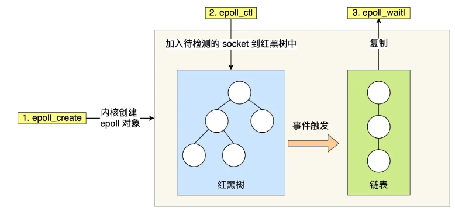

epoll的封装主要有Reactor模式
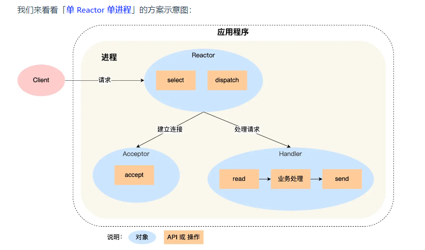
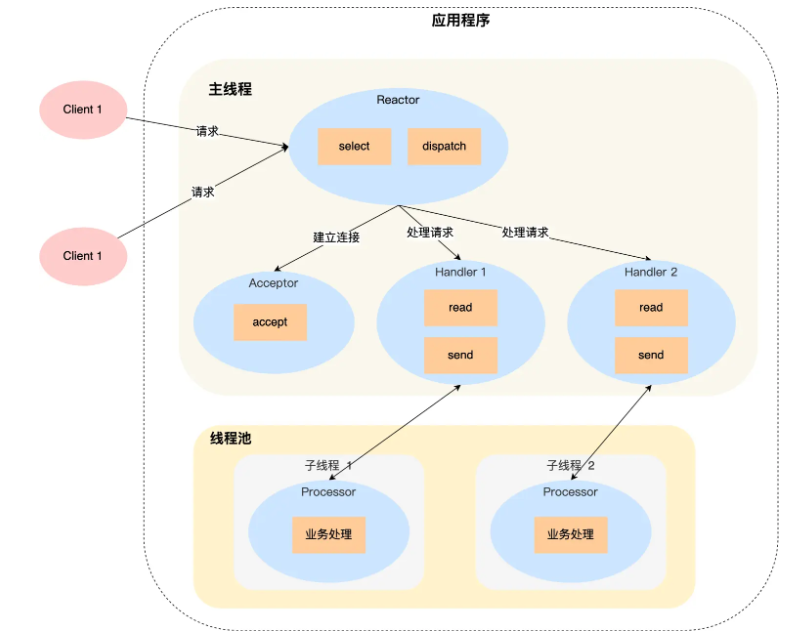
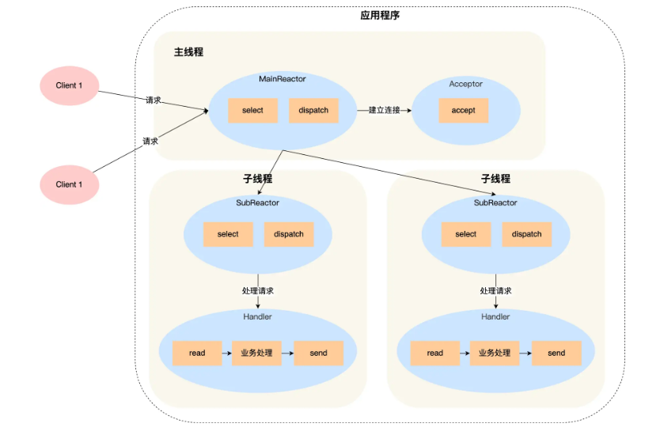

Java中的NIO通常是指由buffer，channel，selector组成的IO模型。Buffer是缓冲区，它与Channel之间双向连接，当进行读操作时会从Channel写到Buffer，写操作时会从Buffer写到Channnel。
Channel是建立了与数据源（如文件、网络套接字等）之间的连接，它会注册到Selector，由Selector进行事件监听
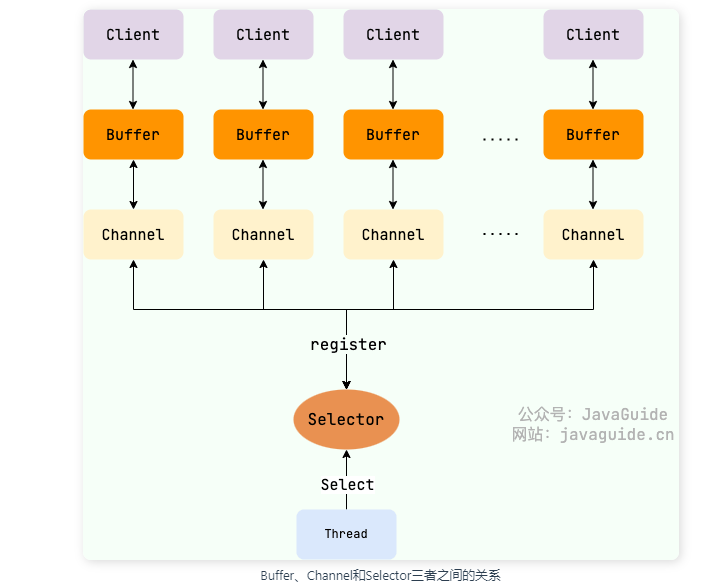
Selector 是基于事件驱动的 I/O 多路复用模型(**也就是前面说的Reactor**)，主要运作原理是：通过 Selector 注册通道的事件，Selector 会不断地轮询注册在其上的 Channel。当事件发生时，比如：某个 Channel 上面有新的 TCP 连接接入、读和写事件，这个 Channel 就处于就绪状态，会被 Selector 轮询出来。Selector 会将相关的 Channel 加入到就绪集合中。通过 SelectionKey 可以获取就绪 Channel 的集合，然后对这些就绪的 Channel 进行响应的 I/O 操作。
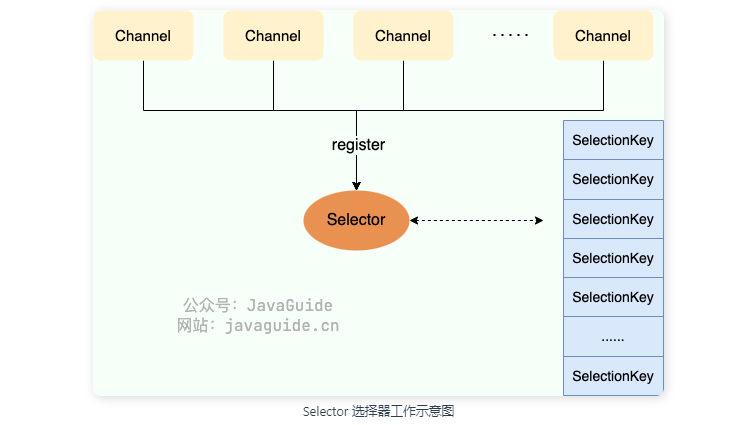
## 线程通信的方式
1.volatile关键字
2.wait/notify
3.condition的signal/await
4.join
## 什么是协程
## 僵尸线程和孤儿线程
僵尸进程：一个进程使用fork创建子进程，**子进程退出**，但是父进程并没有调用wait或waitpid获取子进程的状态信息，那么子进程的进程描述符仍然保存在系统中（会占用进程号之类，还有占用的内存）

孤儿进程：**一个父进程退出**，但它的一个或多个子进程还在运行，那么这些子进程将成为孤儿进程。孤儿进程将被init进程(进程号为1)所收养，并由init进程对它们完成状态收集工作。
## MESI协议和内存屏障
MESI缓存一致性协议主要是为了除了多核cpu内缓存不一致的情况，比如
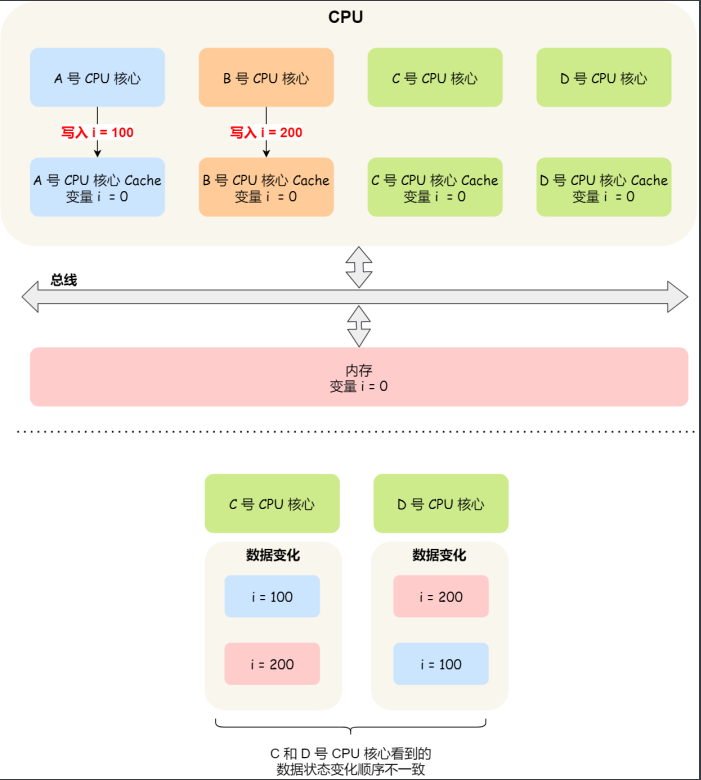
C先看到A的变化，后看到B的变化，于是最后i=200；D先看到B的变化，后看到A的变化，于是最后i=100.造成了变量在不同缓存之间的不一致
MESI协议可以有效解决缓存一致性问题，它有四个状态：
Modified：已修改
Exclusive：独占
Shared：共享
Invalidated：失效
下面这个例子用来说明他们之间的变化已经是如何解决一致性问题的

初始有3块CPU,分别为A,B,C

A先从内存中读取变量X，此时它对变量X的状态为E，在E状态下，可以随意修改数据（修改后状态变为M），因为只有它自己持有数据

接着B也需要从内存中读取变量X，A会接收到B的信号，会将它的数据返回给B。此时A,B的状态都变为S，并且此时A,B的数据都是和内存一致的(因为是从A的E状态转换来的，此时A的缓存和内存中数据一致)

当A需要修改数据时，会向**所有其余的CPU**传递信号，将他们的状态变为I（如果C也有共享的话，C的状态也会变为I），只会A会更新数据，同时将它的状态设为M
需要注意的是，如果之后A还要再次更新数据，那么直接更新即可，不必再向其余的CPU发送消息

B想要读取数据时，会先通知A，A将其数据写到内存中，同时同步到B中，同时A会通知B（如果有其他的CPU也会通知其他的CPU）将其状态修改为S，其本身状态也会修改为S

四个状态的转换图如下


完全遵守MESI会影响cpu利用率，因为A**每次修改变量后都需要等到B对该变量已修改为I的ack**才能完成对变量的更新。因此，引入了一个**存储队列Store Buffer**，A在修改变量之后会直接扔到存储队列里，由存储队列接受B的ack，接收到B的ack以后，存储队列里的变量就会写回A的缓冲区。但存储队列的容量很小，如果存储队列满了，那么A又会恢复到等待B的ack。因此，又引入了一个**失效队列InvalidQueue**，A只需要把被修改的变量(也就是对B而言的失效消息)放进**A存储队列，再由A存储队列放到B的失效队列**中，就可以得到B的ack而不用等待。B在空闲的时候就会去消耗它失效队列里面的消息。
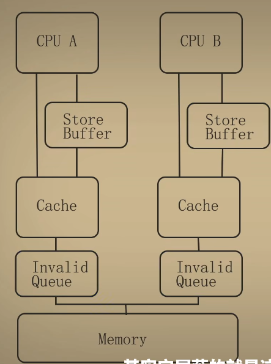
常说的指令重排和cpu乱序执行**有时候**(还有编译器优化的原因)就是因为这两个队列的原因，比如说，有两条语句，先修改D，再修改C。但是D先收到ack，C后收到ack，这样看起来就像是C和D执行顺序颠倒了一样
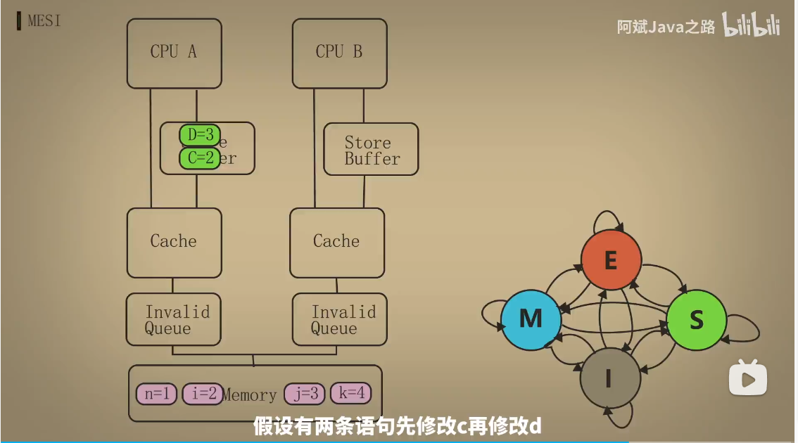
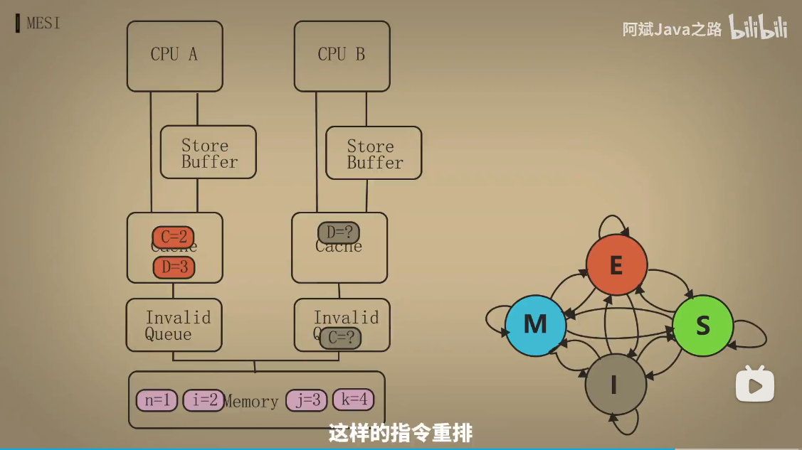
**那么，什么是内存屏障？**
内存屏障也跟上面提到的两个队列有关系，内存屏障分为**读屏障和写屏障**，
其中，在写操作之后加入写屏障，可以保证存储队列里的消息全部被写入到对方cpu的失效队列中，读操作之前加入读屏障，可以保证失效队列中的消息都被消费完
