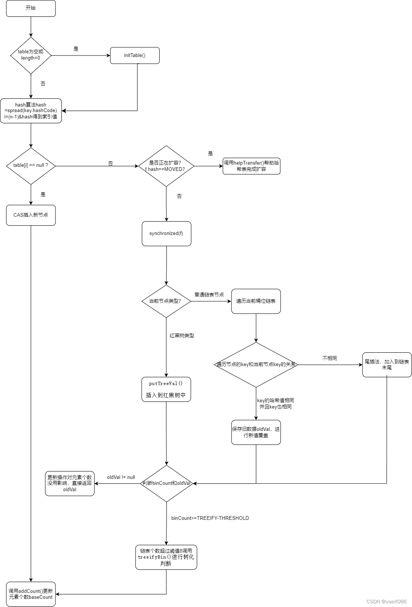

### ArrayList和LinkedList区别
线程安全：都是线程不安全的
底层实现：ArrayList基于Object数组，LinkedList基于双向链表
插入和删除位置：ArrayList在尾部进行删除和插入的时间复杂度都是O（1），在其他位置因为需要把之后的元素往后移，因此平均时间复杂度为O（n）。LinkedList在头和尾的插入和删除的时间复杂度都是O（1），在其他位置因为需要定位元素位置，需要指针沿着链表从前往后移，因此平均时间复杂度为O（n）
是否支持随机访问：ArrayList实现了Randomable接口，支持随机访问，而LinkedList不支持随机访问
额外空间占用：ArrayList的额外空间占用来自于其预留的数组空间，LinkedList的额外空间来源于其存储指针的空间

### StringBuffer和StringBuilder的区别
StringBuffer是线程安全的，而StringBuilder是非线程安全的，并且他们都提供诸如append这样的方法，支持在原有的字符串上进行操作，而不是像String那样需要重新生成

### HashMap线程安不安全，体现在哪里？
hashmap线程不安全，具体体现为：
1.多个线程被分配到同一个桶，那么前一个线程所写的数据可能会被后一个进程覆盖
2.多个线程同时插入时，由于先进行map容量的判断，可能导入插入后的map数据量与实际不符合
并且jdk1.7以前由于采用的是头插法，因此不正确的指针操作可能会导致循环链表

### HashMap底层实现细节
HashMap底层是通过数组+链表的方式实现的，在插入数据时，会先对数据进行hash计算在数组中的插入位置，计算公式为(n - 1) & hash 这个操作在n为2的整数次幂时等价于hash % n，而且执行效率更高，因此hash表的数组容量被设置为2的整数次幂大小。在发生hash冲突时，JDK1.7及之前采用拉链法解决冲突，JDK1.8之后在链表长度大于阈值（默认为8）时会将链表转化为红黑树（转化之前需要先判断数组长度是否小于64，如果小于，会先进行数组扩容）。

### concurrentHashMap如何保证线程安全
jdk1.7以前，是通过分成多个segment，并在进程操作一个segment的时候加锁的方式实现的（此时是Segment+entryset+链表，一个segment对应一个entryset数组，这里的entryset对应hashmap里的数组）
jdk1.8以后，是通过Node锁+CAS+synchronized实现，synchronized只会锁住链表/红黑树的头节点，只要不发生hash冲突就不会产生并发，提升了并发量
一个HashMap不安全而concurrentHashMap安全的例子：
两个线程 1,2 同时进行 put 操作，并且发生了哈希冲突（hash 函数计算出的插入下标是相同的）

HashMap：线程1进行完哈希后，发现未冲突，此时时间片完，线程1挂起
线程2进行完哈希，发现未冲突，于是在桶位写入数据（数组上）
线程1继续执行，由于已经判断过了哈希冲突，线程1直接写入
然而期望的应该是线程2的值，最后表里的值是线程1的，这就发生了数据不一致的现象

concurrentHashMap：线程1进行完哈希后，在当前位置没有Node的情况下，会依据CAS机制进行插入，此时CAS判断通过，会直接插入
线程2继续执行，但是此时CAS机制不通过，插入失败，这时候会通过自旋（循环执行）来保证插入成功
上述是针对桶位没有节点的情况，如果此时桶位上有结点，那么线程1会对链表的头节点加synchronized锁来保证线程安全
在concurrentHashMap中的put操作流程如下：

**JDK1.7以前**的concurrentHashMap在对segment进行put时，会先获取当前segment的锁，如果没有获取到，那么会自旋以尝试获取锁，在获取锁的期间还会获取即将put的节点node（已存在的或者是new出来的）。
获取到锁之后，会计算put的数据要放入的地方index，然后获取HashEntry数组中这个位置的hashentry，如果这个位置的hashentry不存在的话，那么会先检查当前容量，如果插入后超过了当前容量但又小于最大容量的话，那么会先扩容，然后使用头插法直接插入node；如果存在的话，会遍历该hashentry所属链表看是否有相同的元素，如果有那么直接替换，如果没有那么会插入，同样插入前会检查是否需要扩容。
concurrentHashMap扩容后的元素位置并不是重新散列的，而是要么不变，要么等于旧的容量+旧的位置，这是因为这段代码：
int oldCapacity = oldTable.length;
// 新容量，扩大两倍
int newCapacity = oldCapacity << 1;
/ 新的掩码，默认2扩容后是4，-1是3，二进制就是11。
int sizeMask = newCapacity - 1;
 // 计算新的位置，新的位置只可能是不变或者是老的位置+老的容量。
int idx = e.hash & sizeMask;
因为容量扩大了两倍，那么sizeMask也会扩大两倍（比如：00111->01111，严格来说不是两倍）而e.hash是不变的，所以e.hash & sizeMask以后e.hash的位置变为原来的数组长度+原来的位置（比如e.hash原本为10111110，此时长度为16，sizeMask就为1111，此时e.hash & sizeMask = 1110,但是当扩大两倍后，sizeMask变为11111，此时e.hash & sizeMask = 11110，显然等于16+1110，但是当e.hash等于10101110的时候e.hash & sizeMask就会不变了）

### 并发的三大特性
原子性，可见性，有序性

### 为什么是三次握手
1.如果是两次握手，那么客户端只要发出请求就可以建立连接，那么如果有网络中有历史报文传给了服务端，那么就会导致连接建立，造成了资源的浪费
2.两次握手是服务端对请求端的序号进行了确认，但是请求端还没有对服务端的序号进行确认，因此需要第三次握手来保证服务端的序号是正确的

### OOM排查思路
1.是否是内存溢出：内存本身太小，加大内存
2.是否是内存泄漏：这种情况下观察每一次GC完是否都有对象gc不了导致占着内存

### ArrayList
开始容量为0，在第一次添加元素后扩容为10，之后每次扩容为原来的1.5倍，如果扩容之后仍然比需要的新数组容量小，那么就会把要求的数组容量作为新容量，并且会和MAX_VALUE - 8进行比较，最大值只能为MAX_VALUE - 8
在数组扩容时使用了Arrays.copyof(int[] original, int newLength),它实际是调用了System.arraycopy(Object src,  int  srcPos,Object dest, int destPos,int length),System.arraycopy在指定插入时也会用到

### 什么是分布式数据一致性
如果的确能时刻保证客户端看到的数据都是⼀致的，那么称之为强⼀致性。
如果允许存在中间状态，只要求经过⼀段时间后，数据最终是⼀致的，则称之为最终⼀致性。
此外，如果允许存在部分数据不⼀致，那么就称之为弱⼀致性
数据库的一致性指一个状态到另一个状态的一致性，分布式的一致性指各个节点中的数据相同